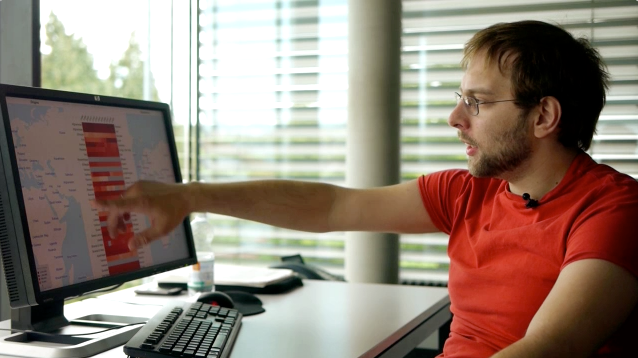

My name is Ilya Boyandin. I design and develop data visualizations.
 
I've completed <a href="/">many projects</a> for media, private companies, NGOs, transportation authorities 
and academic institutions. 

I've worked at IT companies, universities 
and a <a href="http://interactivethings.com/" target="_blank" rel="noopener">renowned design studio</a>. 
Currently I am employed at a <a href="https://www.teralytics.net/" target="_blank" rel="noopener">startup in Zurich</a> focusing on mobility data analysis.

My special interest is in visualizing data about 
geographic movement of people or goods, e.g. transport-related data.
I wrote <a href="/assets/thesis.pdf" target="_blank" rel="noopener">my thesis</a> about this topic.

I am a fan of React, D3, Mapbox and Clojure.

Check out <a href="/resume/" target="_blank" rel="noopener">my full resume</a> for more 
details on my professional background and experience.

I am the father of two wonderful kids. 
I like to play guitar and piano and 
<a href="https://soundcloud.com/ibananti" target="_blank" rel="noopener">produce electronic music</a>.

