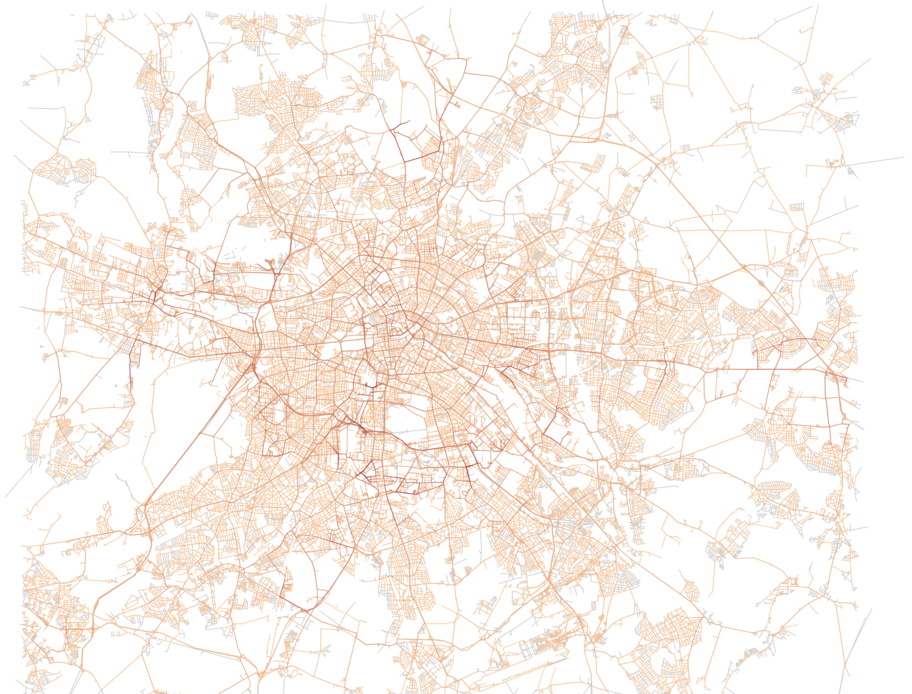
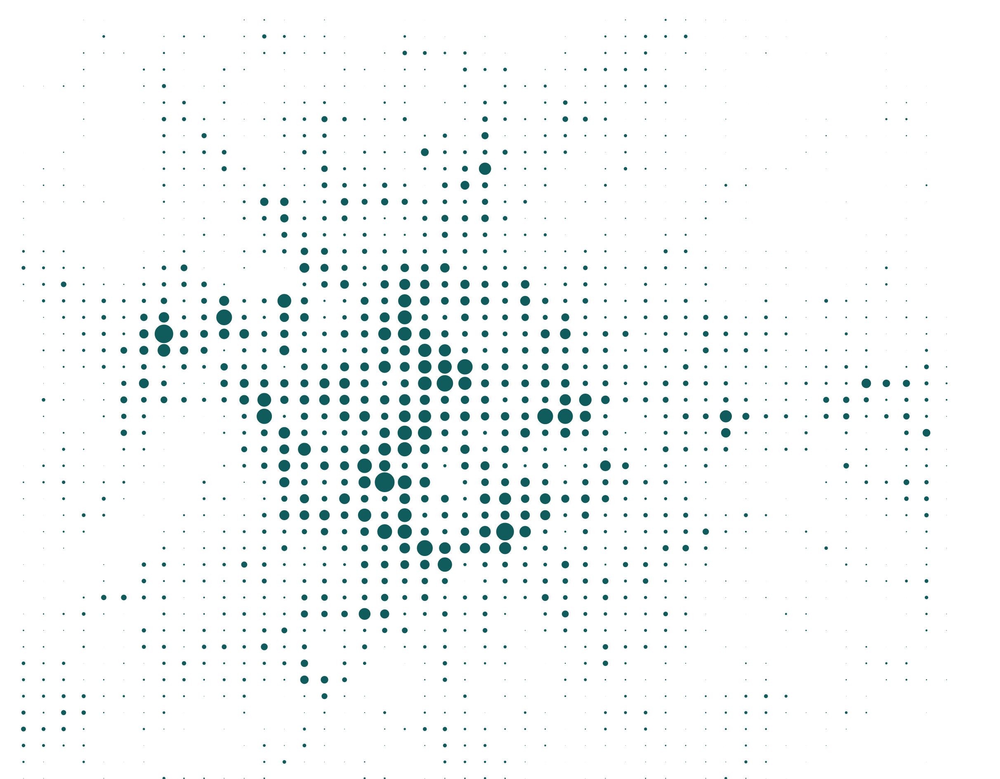
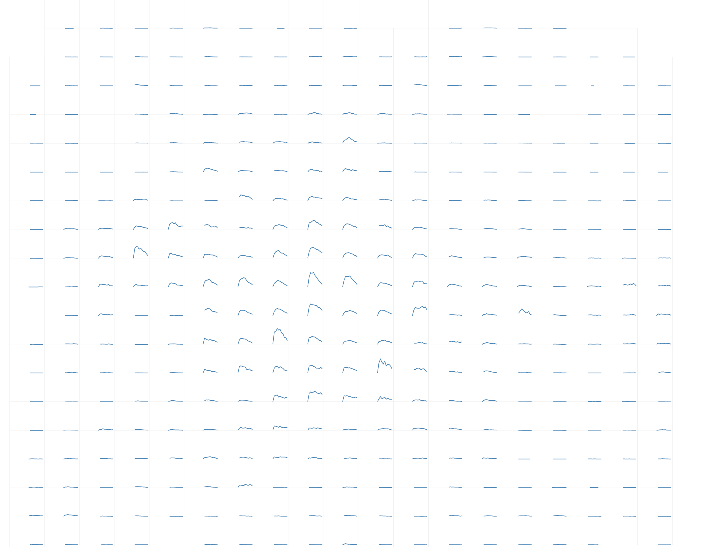
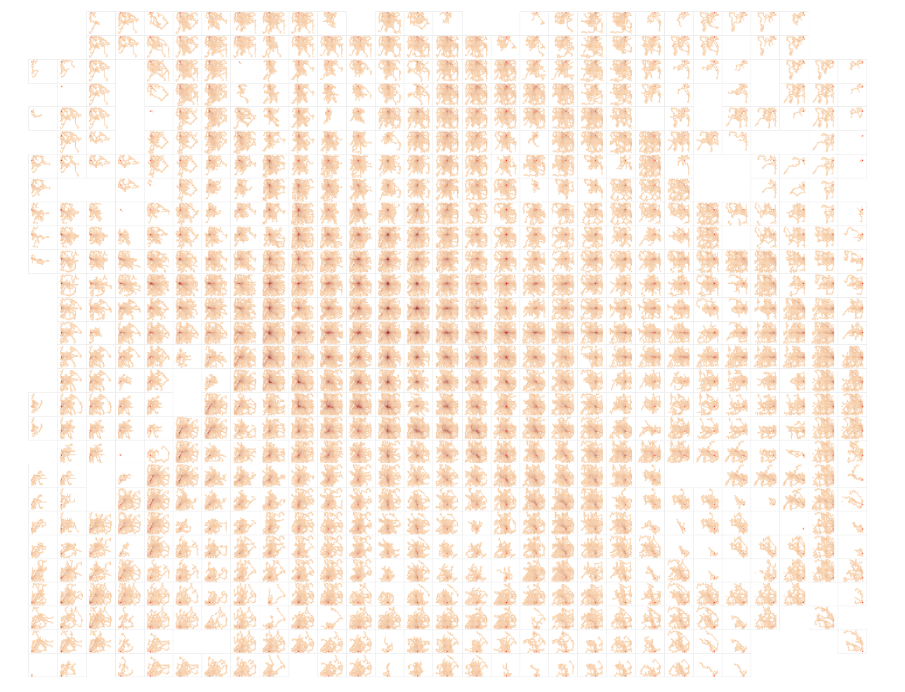

Different approaches to representing the density of people in Berlin: 

Street counts shown by color: 

Aggregated into a regular grid: 

Showing changes during the day for each grid cell:

Cross-visitorship with the recursive OD-map: 

