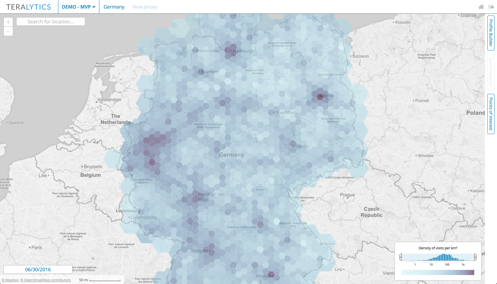
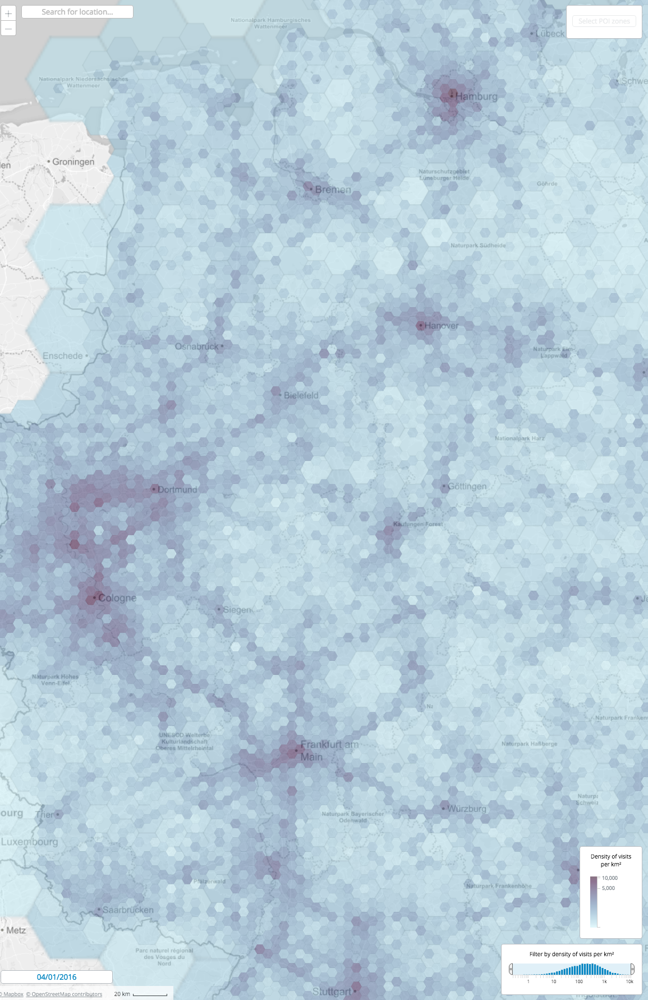

An adaptive hexagon overlay for representing density heat maps with a self-developed geographic 
mapping engine: 

<iframe width="560" height="315" src="https://www.youtube.com/embed/pIZSfswEUaU?rel=0&amp;controls=0&amp;showinfo=0" frameborder="0" allow="autoplay; encrypted-media" allowfullscreen></iframe>

