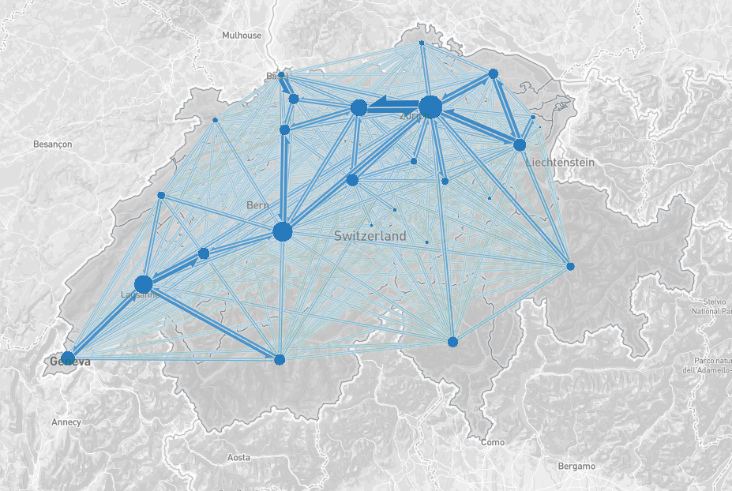

As a member of the team at Teralytics I worked on the development of the 
[flowmap.gl](https://github.com/teralytics/flowmap.gl) library.

 
The library can be used for visualizing movement of people (e.g. migration) or objects between 
geographic locations. The layer is rendered in WebGL and can handle large numbers 
of flows with a good rendering performance.

   

