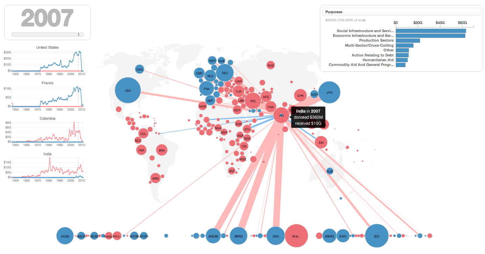
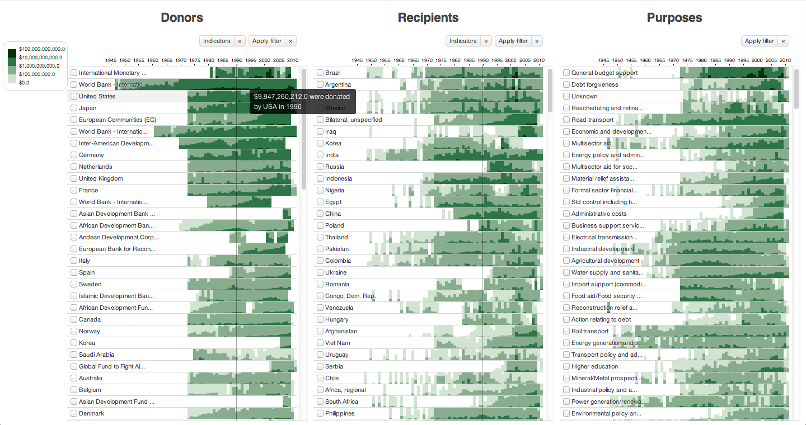
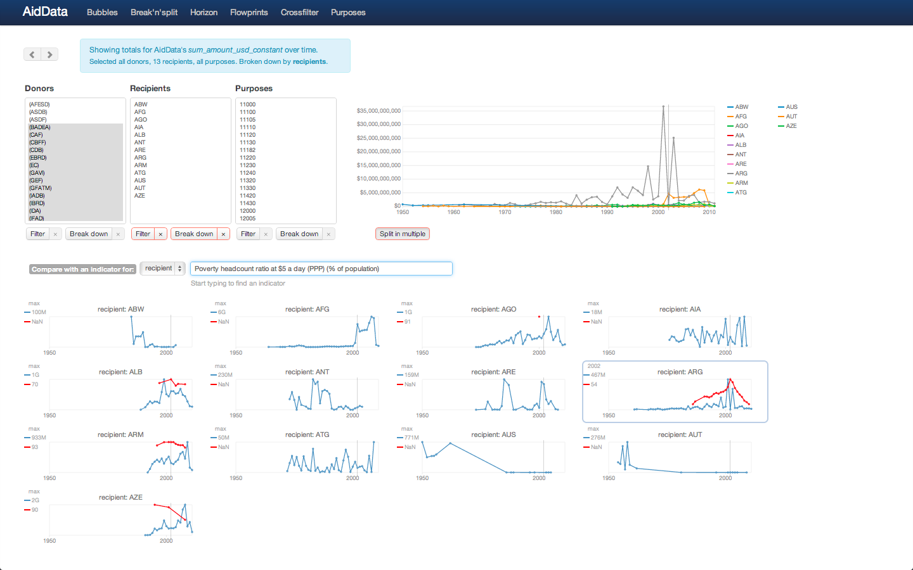
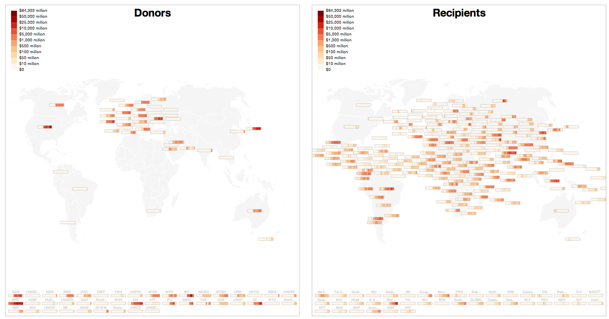

Visualizing flows of financial aid donated to countries by international organizations and by other countries. In collaboration with [AidData.org](http://aiddata.org).

 [Try in action](http://aiddata.herokuapp.com/) or fork [on github](https://github.com/ilyabo/aiddata).

 

 
