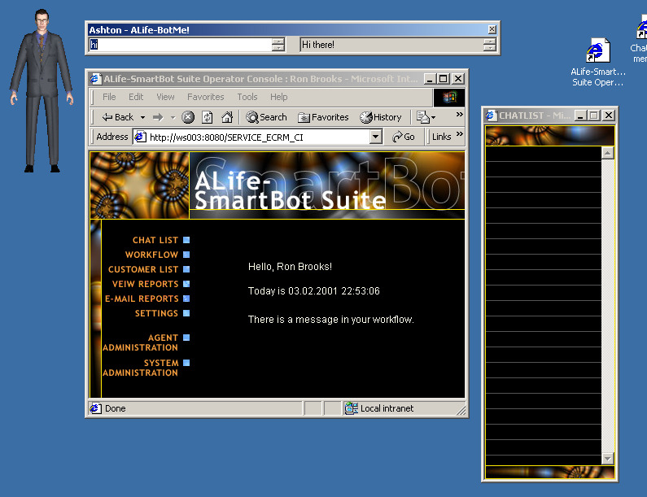
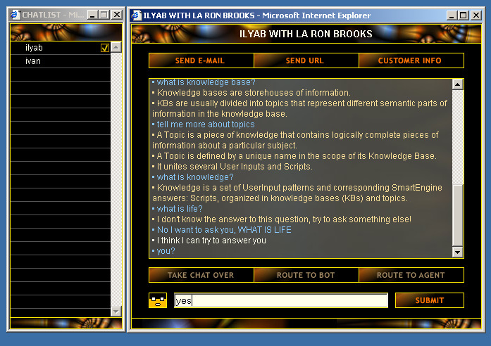
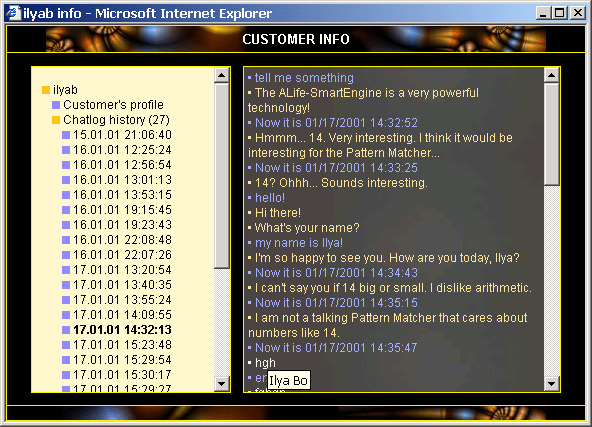
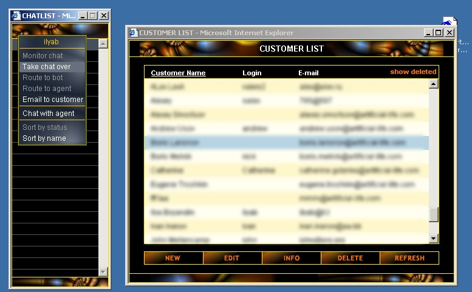
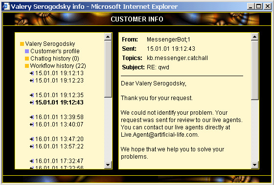
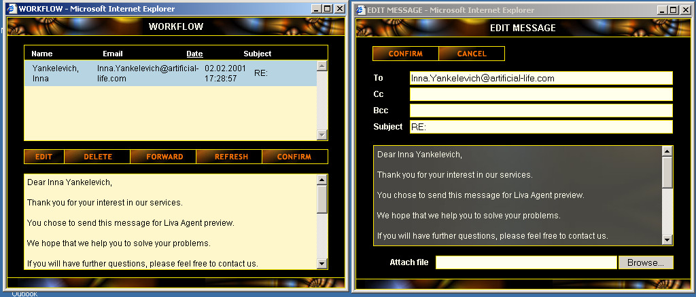
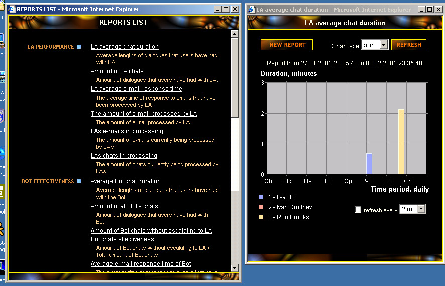

I participated in the development of a system of intelligent agents
capable of chatting to visitors of a website in a natural language and
promoting its products.
I implemented a highly dynamic web-interface for the subsystem that
controlled the chats and let operators intervene in a chat
if a bot was in trouble.
                            

