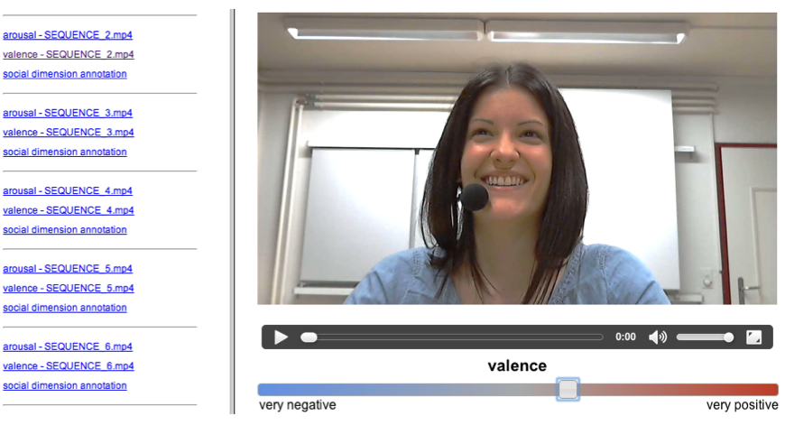

A simplistic web app for annotating emotions in human speech video recordings. 
The tool was used for 
[this publication](https://www.researchgate.net/figure/ANNEMO-web-based-annotation-of-affective-and-social-behaviors_fig2_261121552).
Check [this page](https://diuf.unifr.ch/main/diva/recola/annemo) for more detail.
The tool is available at [github.com/ilyabo/annemo](https://github.com/ilyabo/annemo/).
                

