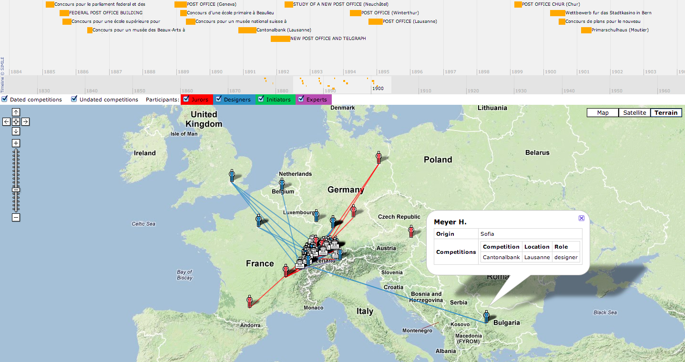

A historical spatio-temporal visualization showing how architects from Europe participated
in architectural competitions in Switzerland. Built for a project led by
[Sofia Paisiou](https://fhnw.academia.edu/SofiaPaisiou) 
resulting in [this publication](https://www.researchgate.net/publication/265140793_Moving_architectures_Visualizing_and_Analyzing_Relationships_in_19th_century_Architectural_Competitions_in_Switzerland). 

