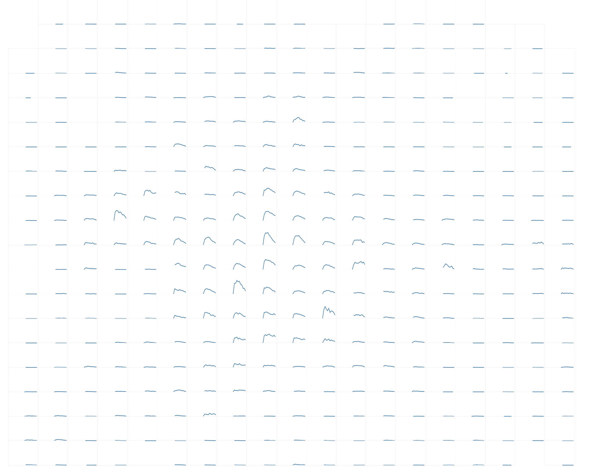

Different approaches to representing the density of people in Berlin: 

Street counts shown by color: 

Aggregated into a regular grid: 

Showing changes during the day for each grid cell:

Cross-visitorship with the recursive [OD-map](https://openaccess.city.ac.uk/id/eprint/537/1/wood_visualization_2010.pdf): 

