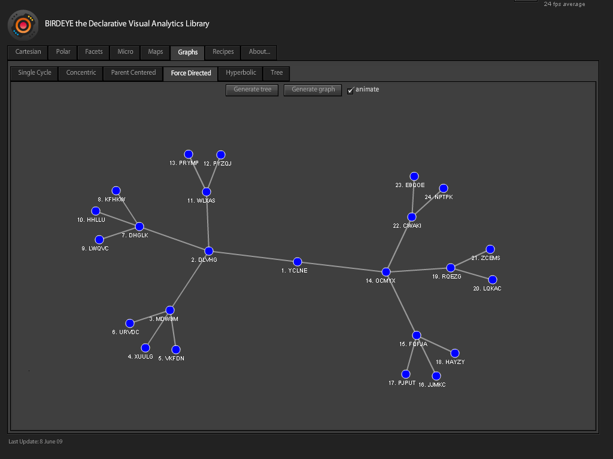
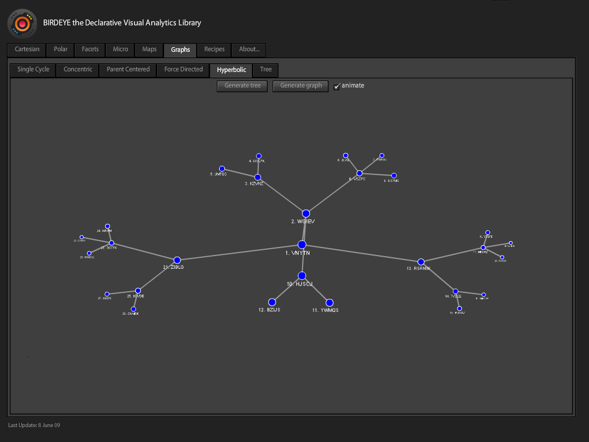
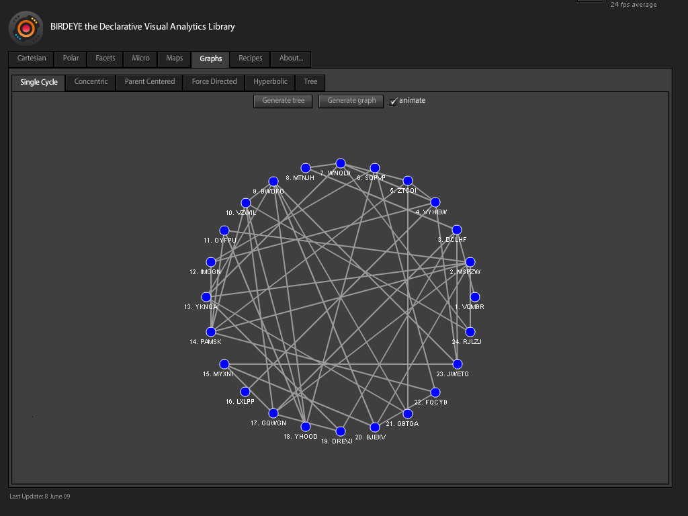
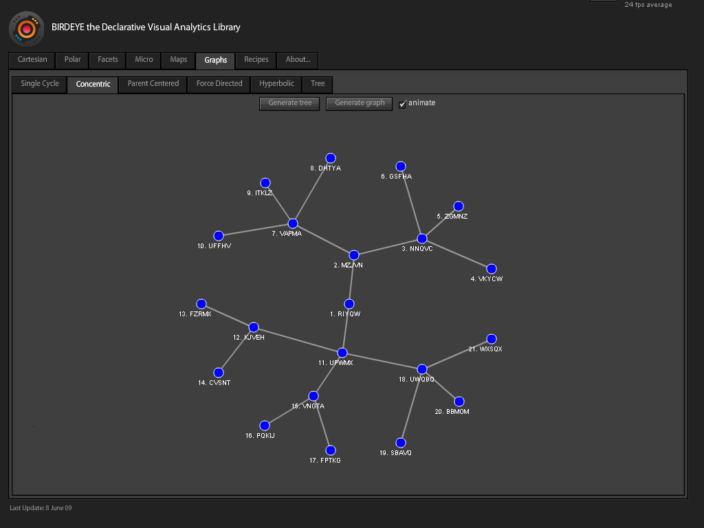

[BirdEye](http://code.google.com/p/birdeye/) is a Flex visualization library which follows the approach to building visualizations described by Leeland Wilkinson in his book "[Grammar of Graphics](http://www.amazon.com/Grammar-Graphics-Statistics-Computing/dp/0387245448)". BirdEye can be seen as a language for creating visualization which not only provides a set of predefined visualization types, but also allows the users to create new kinds of visualizations easily.

My contribution to BirdEye so far has been to make the animated graph layouts from the previous library version work within the new framework based on the Grammar of Graphics.

