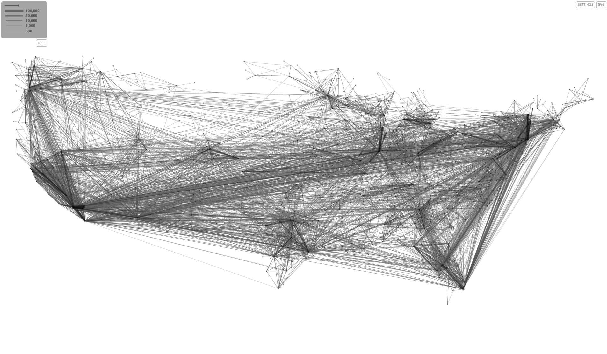
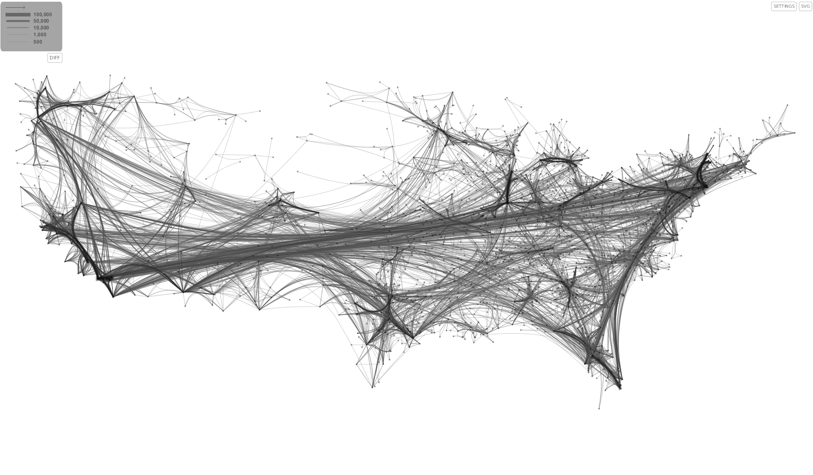

Edge bundling can help making a cluttered graph visualization more readable by rerouting the edges so that they form bundles emphasizing the high-level graph structure.

JFlowMap has an impementation of Danny Holten's [force-directed bundling algorithm](https://www.researchgate.net/publication/220506264_Force-Directed_Edge_Bundling_for_Graph_Visualization).

JFlowMap can be downloaded from [here](https://code.google.com/p/jflowmap/downloads/list).
The source code is available at [github.com/ilyabo/jflowmap](https://github.com/ilyabo/jflowmap/).
