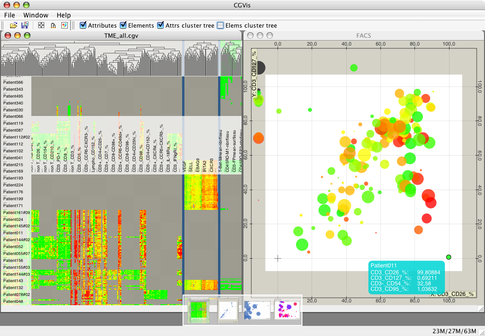
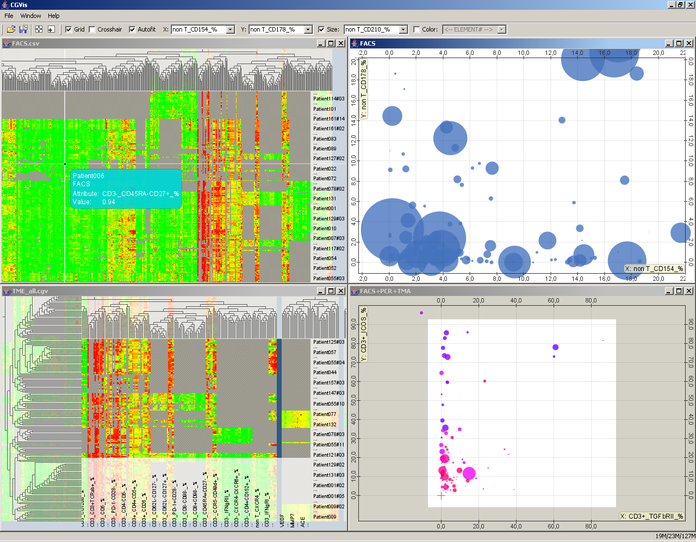
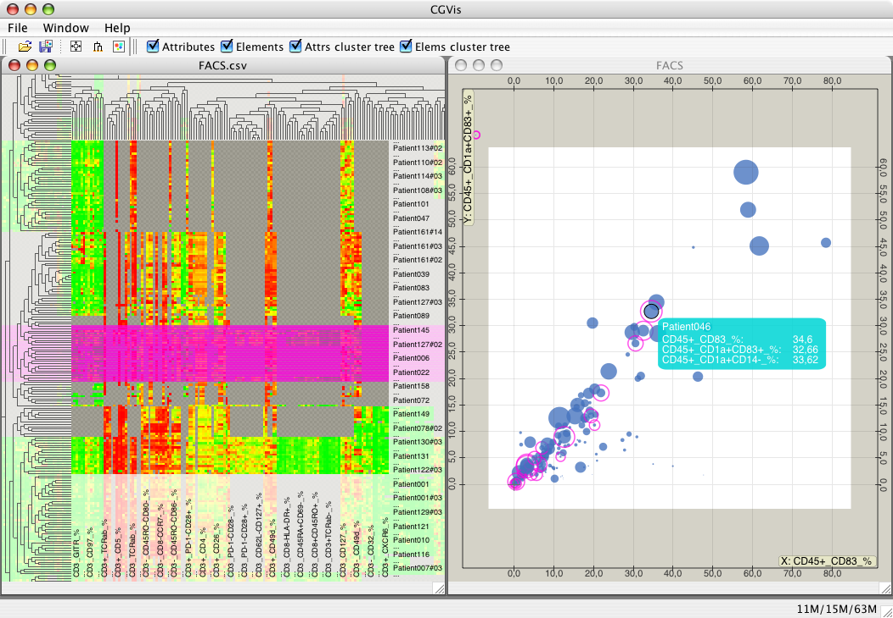
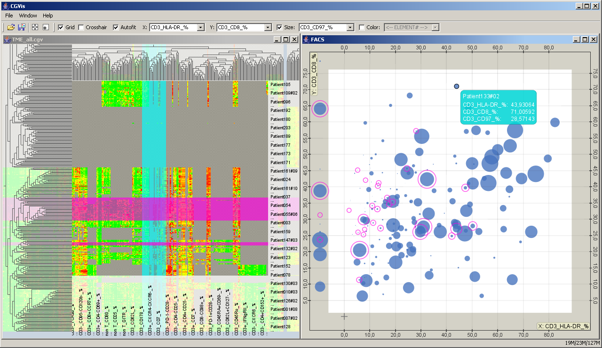

CGVis is an open source generic data visualization tool with an innovative zoomable user interface and animations which help the user find particular features in his data.

<iframe width="560" height="315" src="https://www.youtube.com/embed/uNuOjlZ0Rdw?rel=0&amp;showinfo=0&amp;start=10" frameborder="0" allow="autoplay; encrypted-media" allowfullscreen></iframe>

 

The tool is available for download from [here](http://code.google.com/p/cgvis/).
