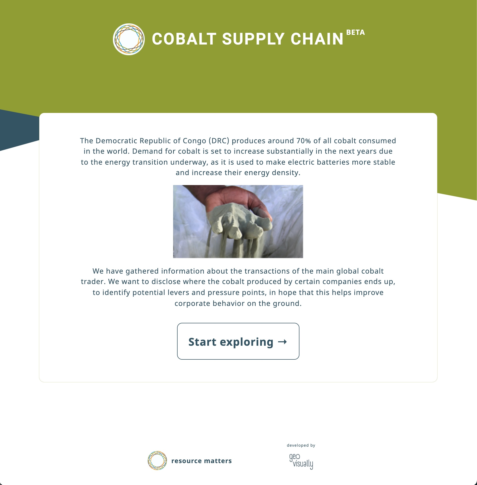
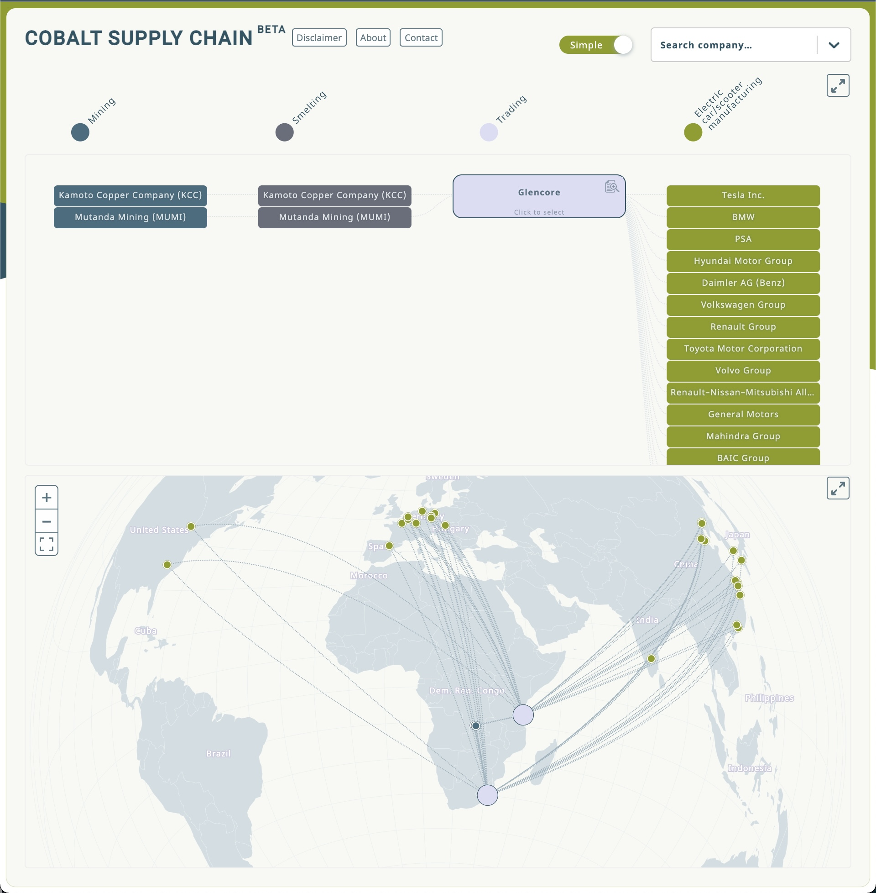
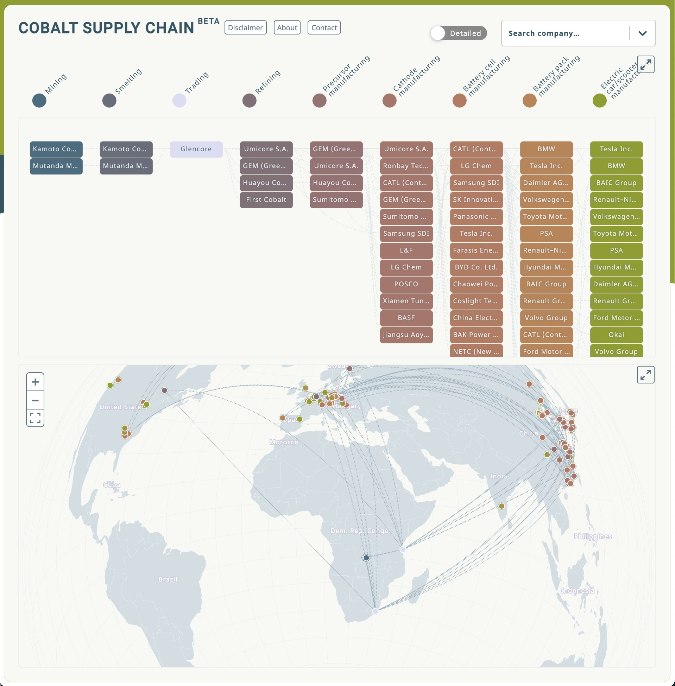
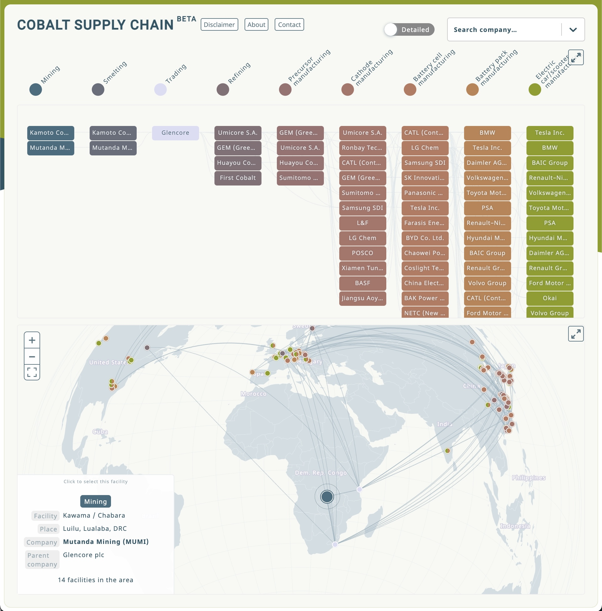
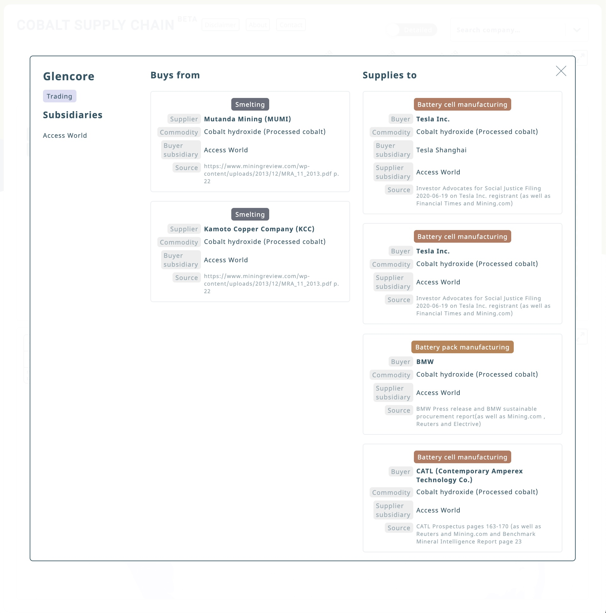
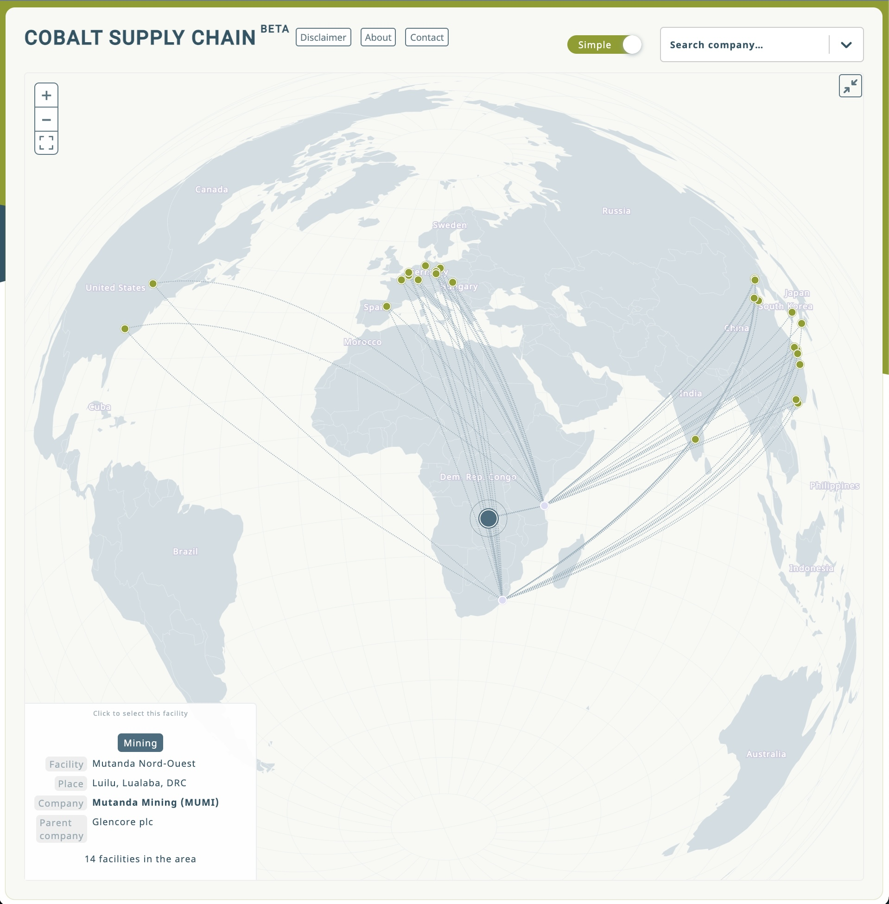

Check out the <a target="_blank" href="https://supplychains.resourcematters.org">online version</a>.

Testimonial from <a href="https://resourcematters.org">Resource Matters</a>:

> We collaborated with Ilya on the development of a platform visualizing transactions along supply chains of several cobalt-containing products. We were very satisfied with the results. After a quick introductory call, Ilya presented a mockup that ended up being pretty much the final version, at the same time that he solved a big issue we had with our data at the beginning. Further work then consisted in increasing our initial ambitions of data to display. The back and forth was always speedy. By asking the right questions, Ilya understood (and made us understand, which is more complicated as we are not visualizations experts) easily what we wanted to communicate and how to make it more clear and user-friendly. The final product achieves a balance between being light, beautiful, and self-explanatory, in a much better way than we could ever imagine. We plan to continue working with Ilya for future iterations of this platform and also future projects, and would very much recommend other companies to hire his services.

