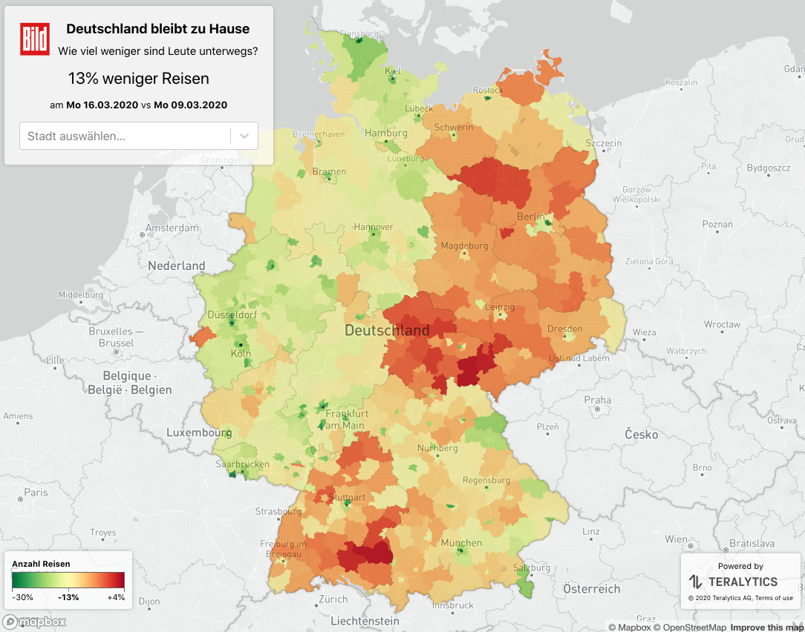

Thi map showing the effect the lock-down had on mobility was published in
[Bild](https://www.bild.de/news/inland/news-inland/corona-krise-interaktive-karte-26prozent-weniger-bewegungen-69569116.bild.html).

