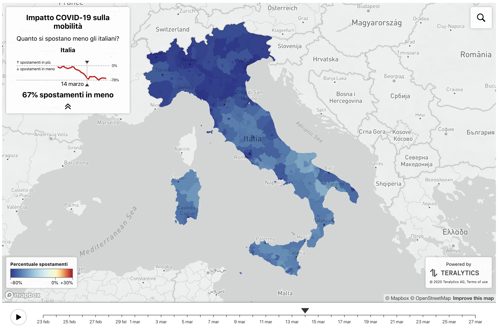
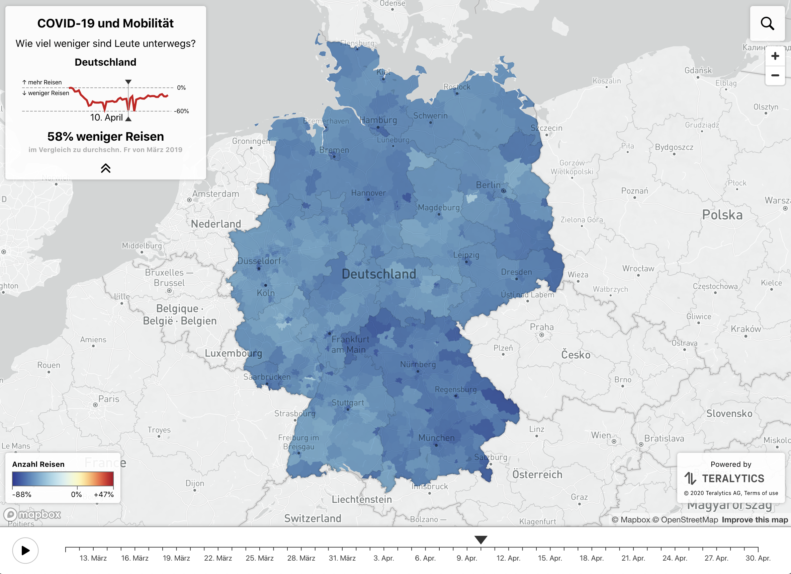
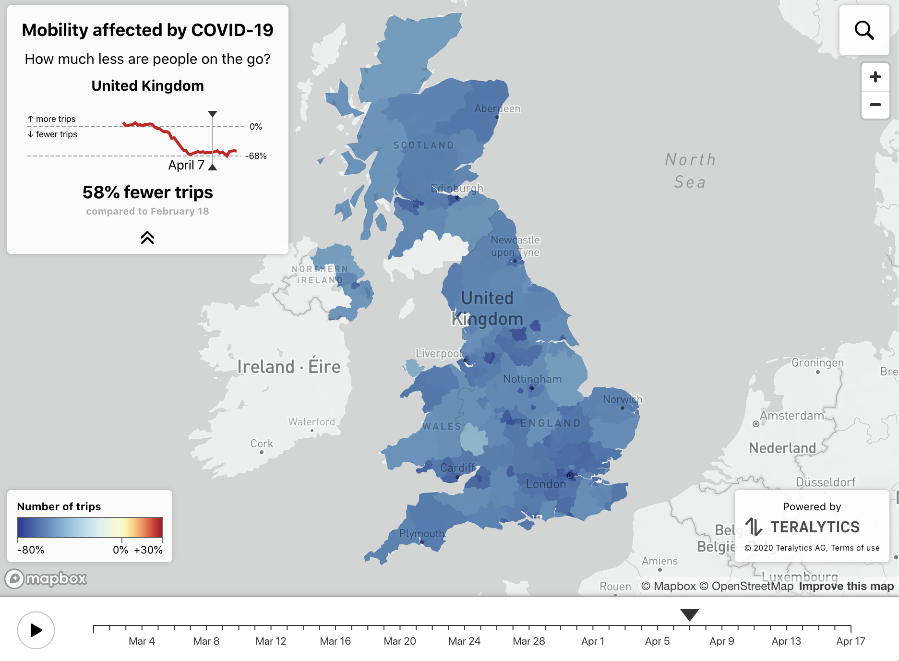
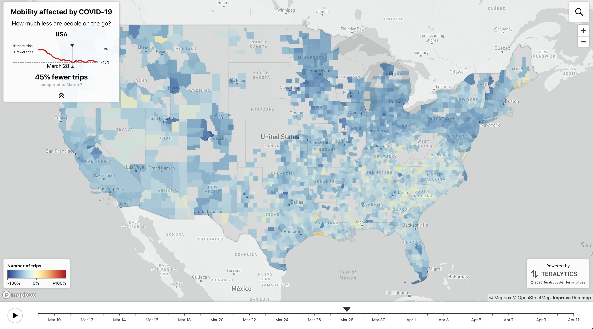
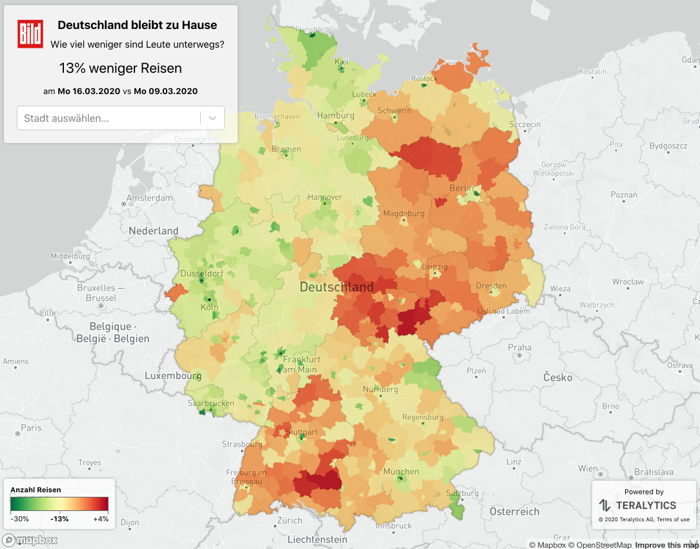

I developed several interactive maps showing the effect the lock-down had on mobility. 
This was a part of 
[Teralytics' supporting effort to arrest the spread of the pandemic](https://www.teralytics.net/mobility-and-covid-19/).

The maps were published in
[La Repubblica](https://lab.gedidigital.it/repubblica/2020/cronaca/coronavirus-mappa-italia-impatto-sulla-mobilita/?ref=RHPPLF-BH-I252606083-C8-P3-S1.8-T1%E2%80%A6),
[Forbes](https://www.forbes.com/sites/jeremybogaisky/2020/04/14/coronavirus-united-states-movement-map/#3d1941615d2f), 
[Bild](https://www.bild.de/news/inland/news-inland/corona-krise-interaktive-karte-26prozent-weniger-bewegungen-69569116.bild.html),
[Daily Mail](https://www.dailymail.co.uk/news/article-8222805/Map-shows-peoples-movements-dropped-87-parts-lockdown.html),
[Osnabrücker Zeitung](https://www.noz.de/deutschland-welt/gut-zu-wissen/artikel/2035155/interaktive-landkarte-so-sehr-steht-deutschland-still).

The map of Germany was also featured in the 
[COVID-19 Mobility project](http://rocs.hu-berlin.de/covid-19-mobility/)
 from [Robert Koch Institute & Humboldt University of Berlin](http://rocs.hu-berlin.de/covid-19-mobility/team/)
 with the following [scientific publication](https://arxiv.org/pdf/2007.01583.pdf).

