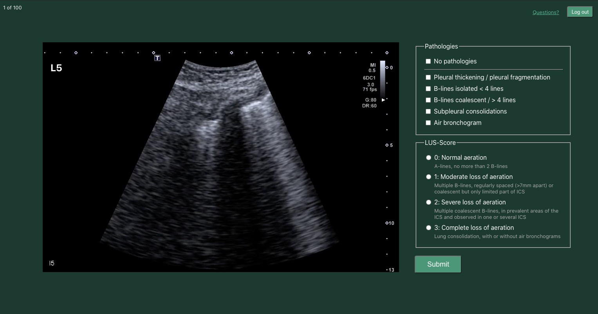
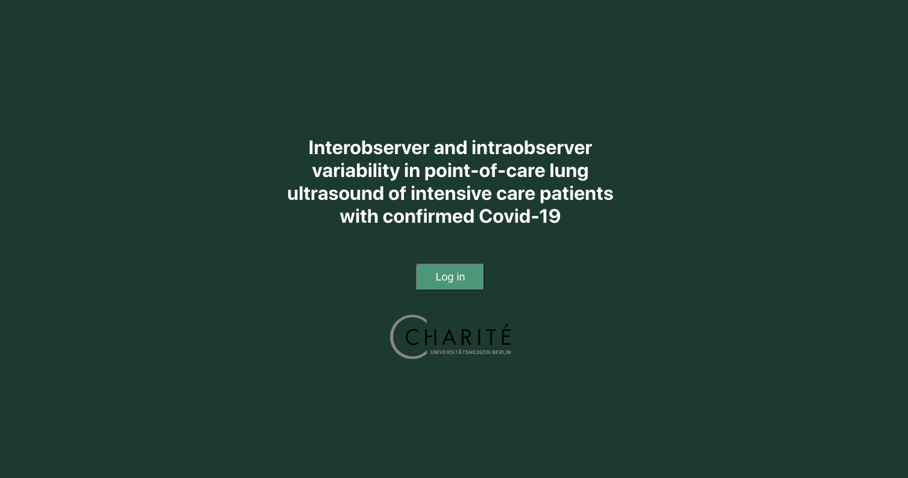
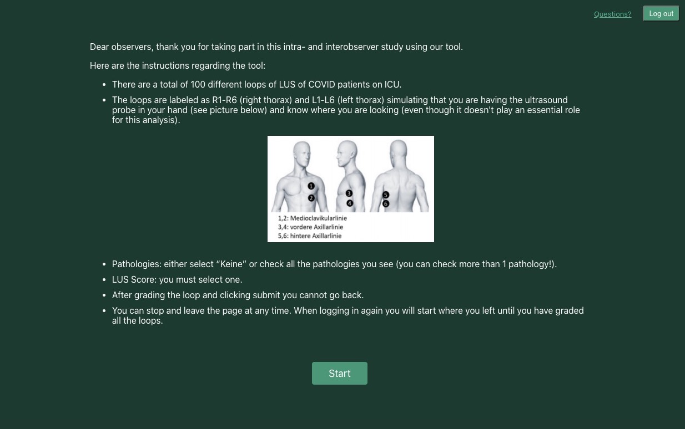

This was a project I volunteered to help with. 
I built a simple video annotation tool used for the medical study “Interobserver and intraobserver variability in point-of-care lung 
ultrasound of intensive care patients with confirmed Covid-19” at [Charité Universitätsmedizin Berlin](https://nephrologie-intensivmedizin.charite.de). 
The source code is available [here](https://github.com/ilyabo/covid19-charite-lus).

<video width="100%" controls style="max-width: 900px" autoplay loop>
    <source src="grading.mp4" type="video/mp4"/>
  
</video>

