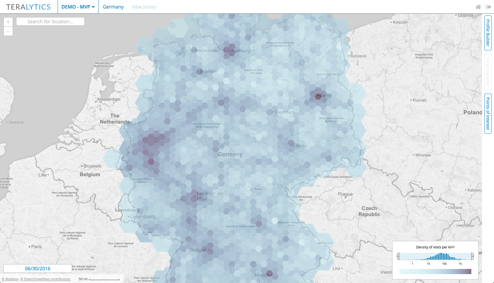
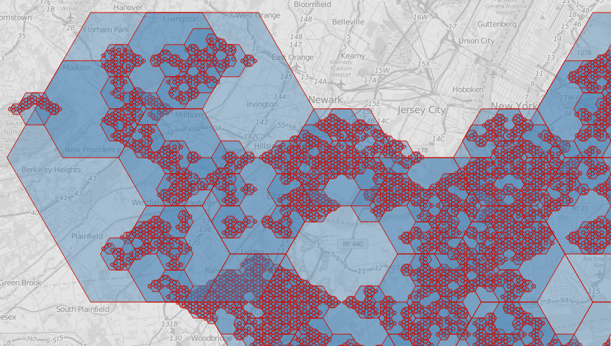
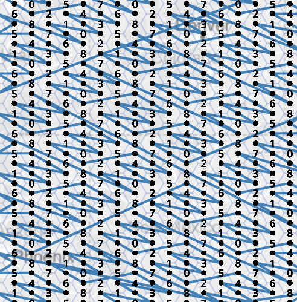
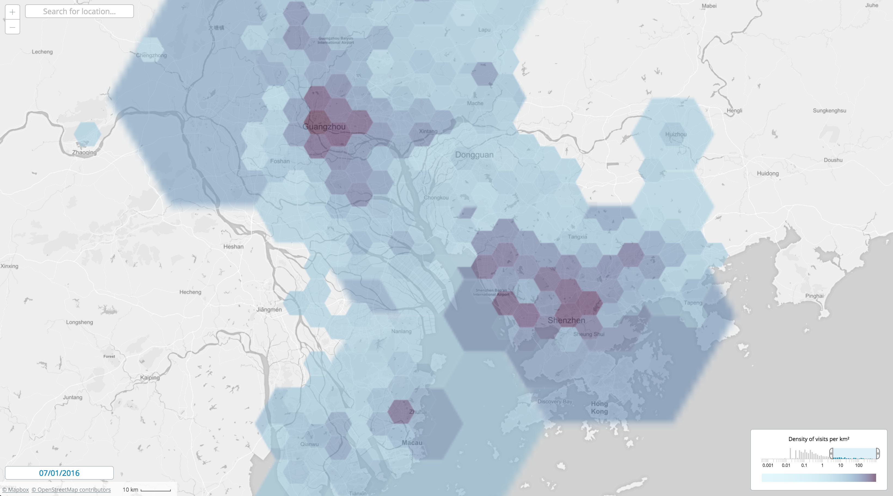
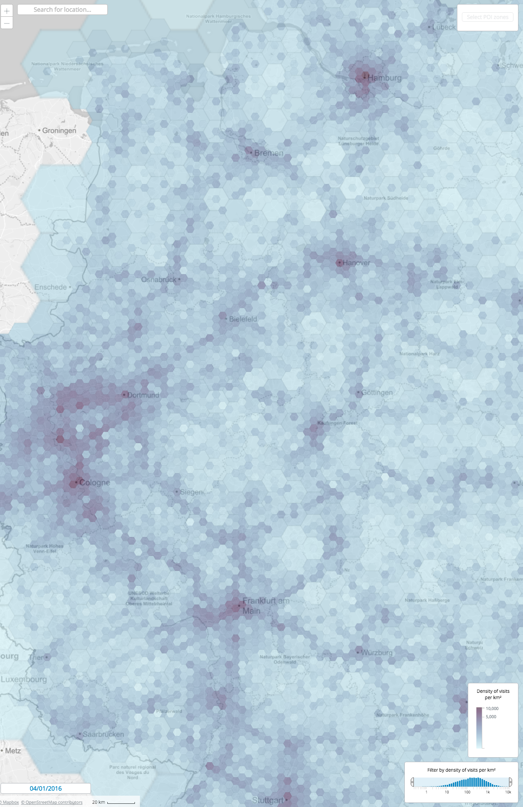

A zoom-adaptive hexagon overlay for representing density heat maps 
with a self-developed slippy map engine. 
Here we also used [our](https://github.com/teralytics/geohex) hierarchical hexagonal system based on 
[Geohex](https://github.com/ilyabo/geohex.js)
for geospatial indexing: 

Here are [Geohex](https://github.com/ilyabo/geohex.js) hexagons on several levels: 

Each hexagon has a unique code.
We can reconstruct the geometry of a hexagon from its code.
Smaller hexagons within the larger ones have codes prefixed by the codes of their "parent" hexagons.
The nesting is not perfect, though. 

 
[Z-curve](https://en.wikipedia.org/wiki/Z-order_curve) for the hex codes:

<iframe width="560" height="315" src="https://www.youtube.com/embed/pIZSfswEUaU?rel=0&amp;controls=0&amp;showinfo=0" frameborder="0" allow="autoplay; encrypted-media" allowfullscreen></iframe>

