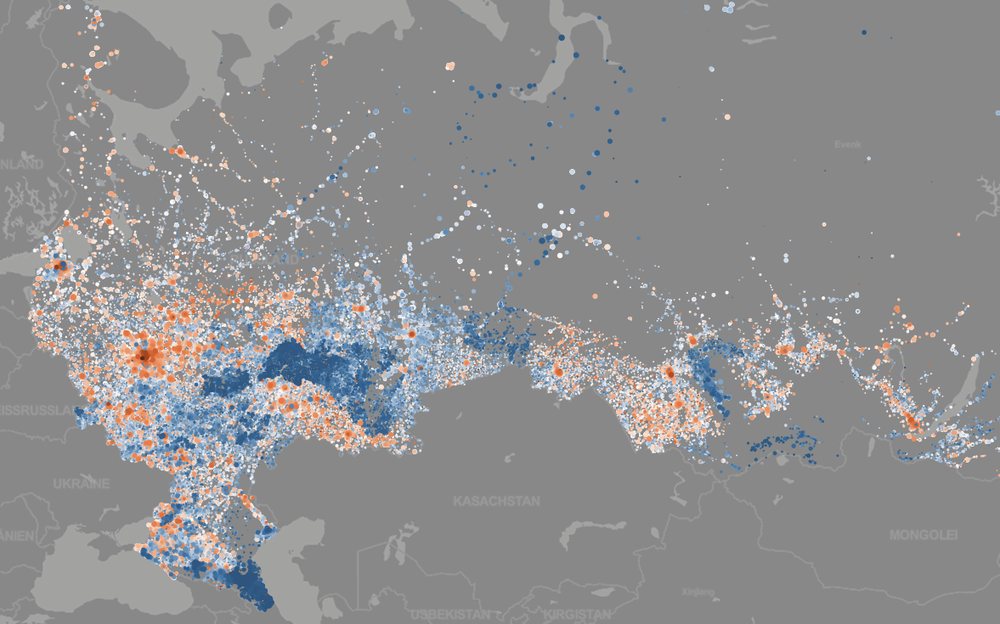
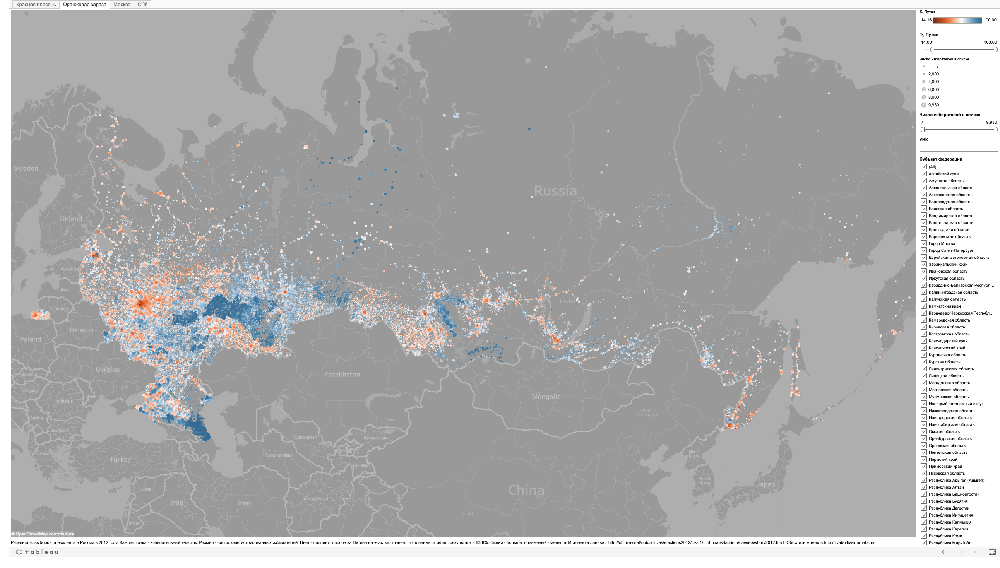
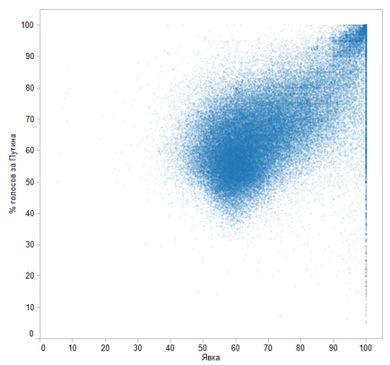
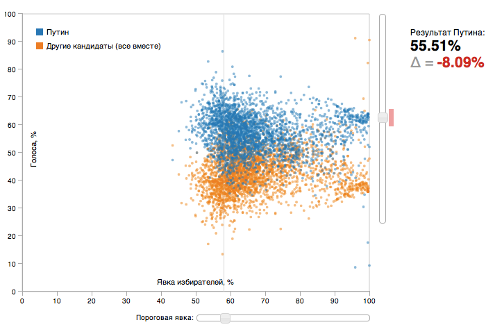

  The presidential election in 2012 in Russia was clearly fradulent.
  Despite manipulating the results the authorities published very detailed data on the elections
  which made it possible to analyse it and find traces of fraud.

The dark blue dots show polling stations which reported unlikely high votes for Putin:

The above visualization was used by the Danish online magazine Europa in [this article](http://translate.google.com/translate?sl=auto&tl=en&js=n&prev=_t&hl=en&ie=UTF-8&u=http%3A%2F%2Fmagasineteuropa.dk%2F%3Fp%3D5544&act=url) (translated from Danish).

The interactive version can be found [here](http://public.tableausoftware.com/views/russian-presidential-elections-2012-map-orange/sheet1?:embed=y) (it is quite slow in loading).

## Vote for Putin vs Turnout

Each dot is a polling station, x-axis is the turnout, y-axis is vote for Putin. Here you can see that there is a very high correlation between the turnout (the percentage of people who voted) and the vote for Putin. This correlation is most probably due to the fact that in the polling stations where the turnout was reported as unlikely high votes for Putin were injected.
Anoter anomaly is “the grid pattern”, that is, the higher concentration of reported turnout and vote for Putin around 75, 80, 85, 90, 95%. This is a clear evidence of fraud.

## Estimating the amount of fraud

This simple visualization allows to estimate the amount of fraud by eliminating one of the suspicious anomalies of the vote distribution, namely, the correlation between turnout and vote for Putin. Click for the interactive version:

