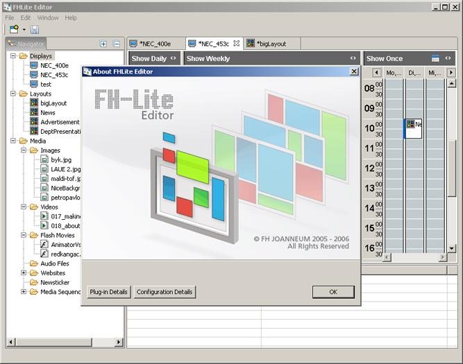
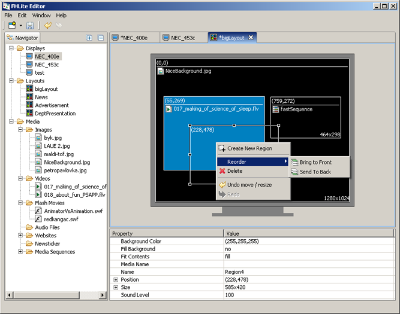
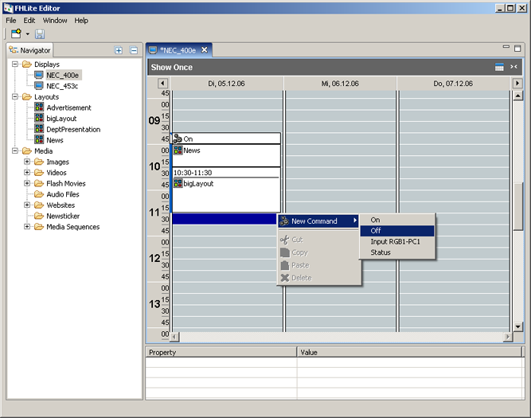
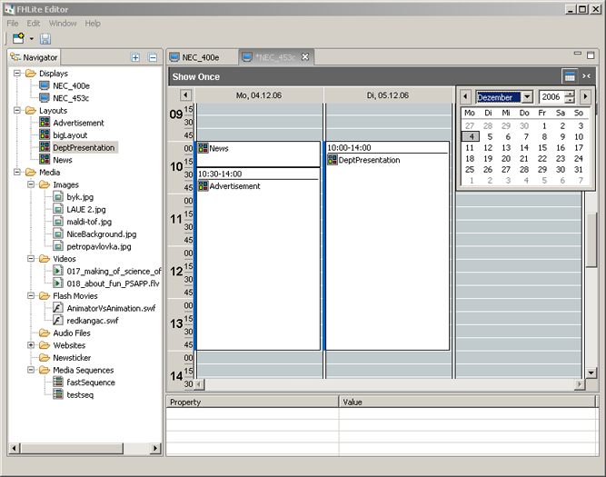
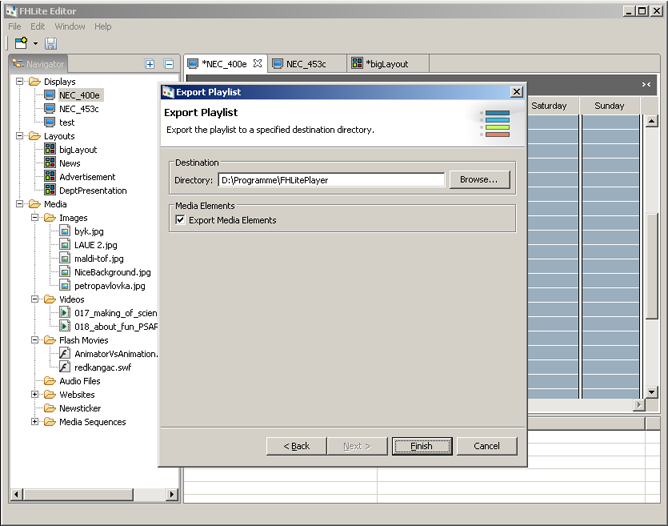
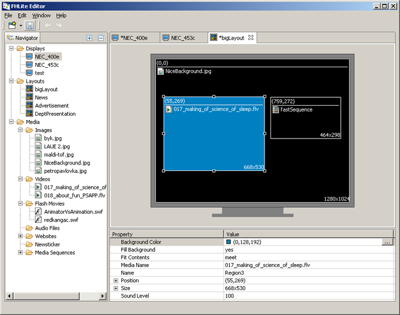
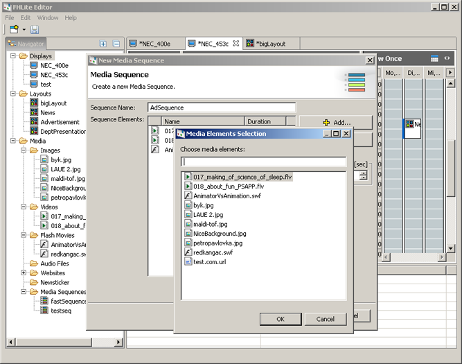
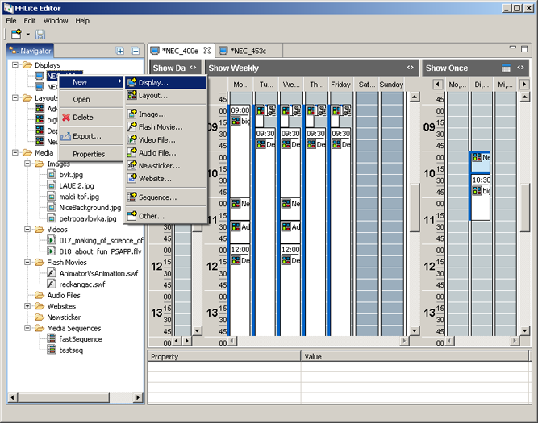
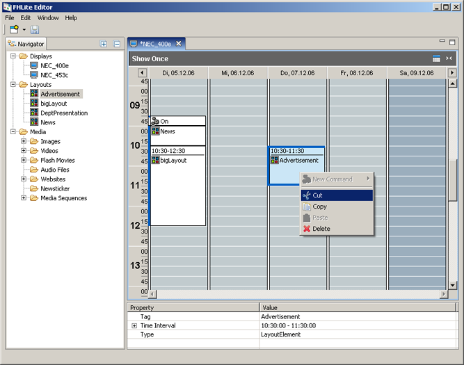
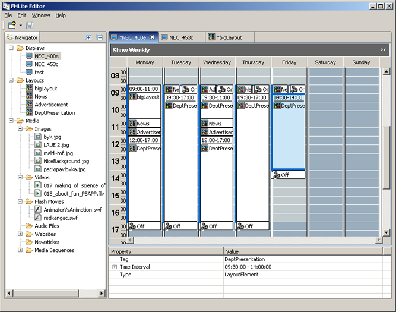

Screen or presentation manager which allows to create layouts from videos, images, flash movies and other media for a screen and then to schedule them. 

My contribution to this project were the visual layout and schedule editors, that is, the most interesting parts of the UI :)

