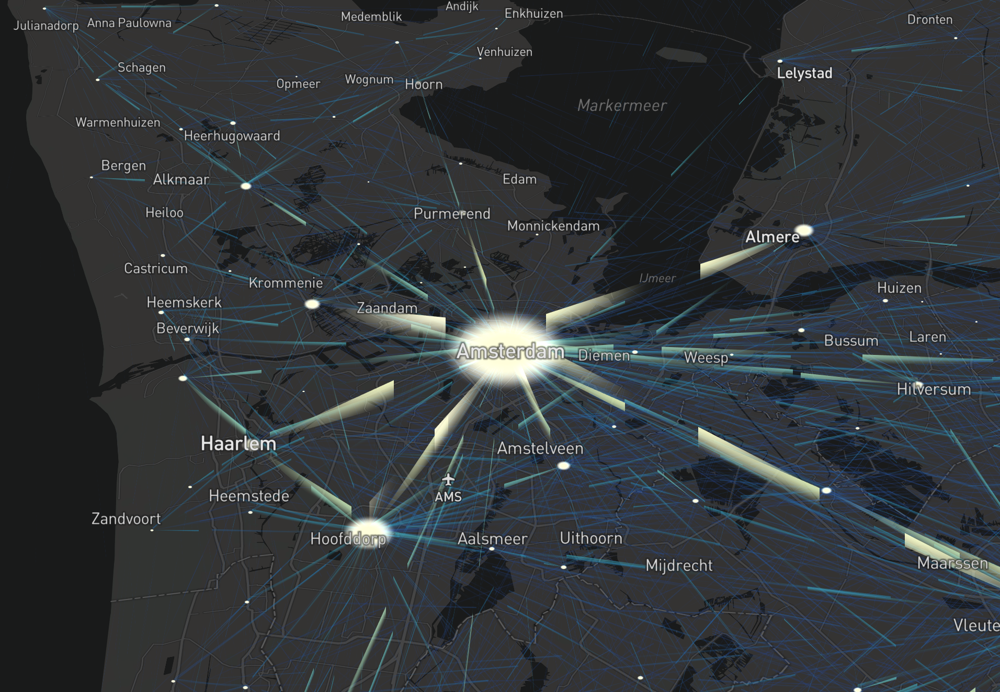

This is an experimental shader-based demo using 
Mapbox GL JS [custom style layer API](https://docs.mapbox.com/mapbox-gl-js/example/custom-style-layer/)
showing commuters in the Netherlands in 2016.
Inspired by the [cf. city flows](https://uclab.fh-potsdam.de/cf/) project. 
The data is from [Statistics Netherlands](https://opendata.cbs.nl/#/CBS/nl/dataset/83628NED/table?dl=F076).

Check out [the Observable notebook](https://observablehq.com/@ilyabo/animated-flow-map-of-commuters-in-the-netherlands-in-2016)
with the live flow map and the source code.

<iframe width="846" height="556" src="https://www.youtube-nocookie.com/embed/ZmbT06xajik?rel=0&amp;controls=0&amp;showinfo=0" frameborder="0" allow="autoplay; encrypted-media" allowfullscreen></iframe>

