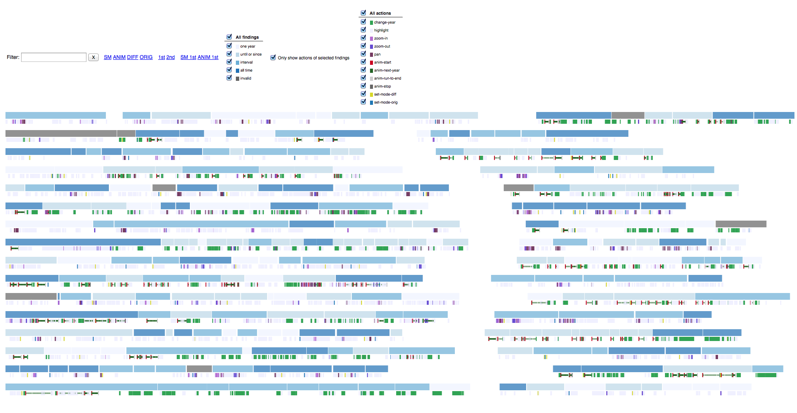
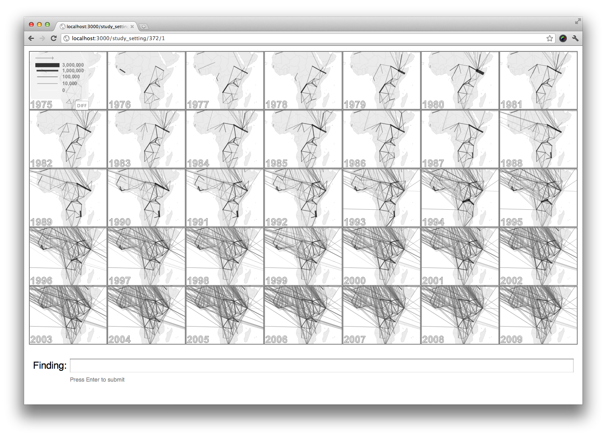
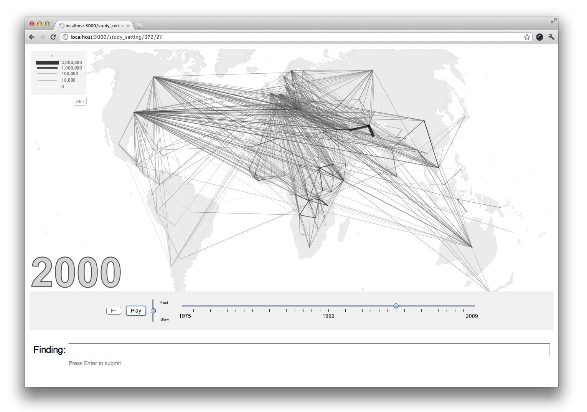
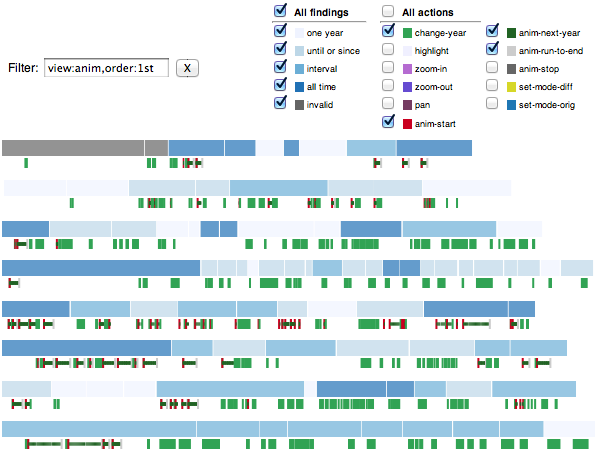
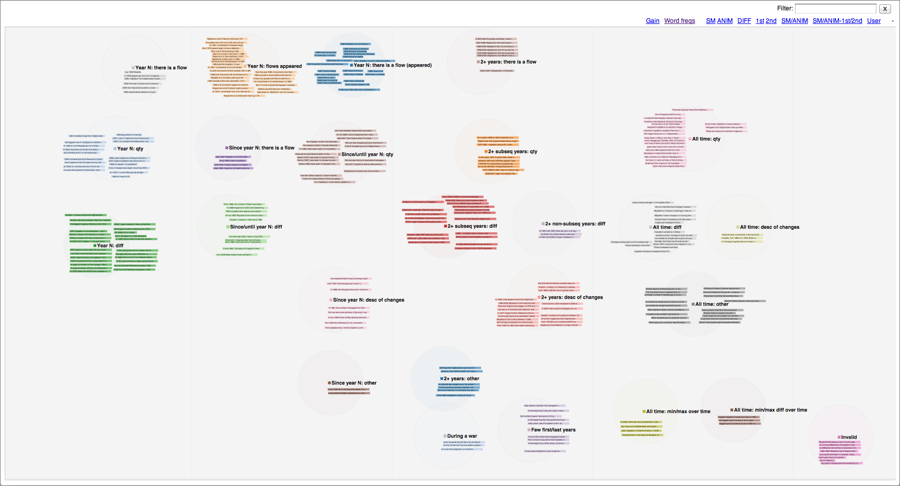
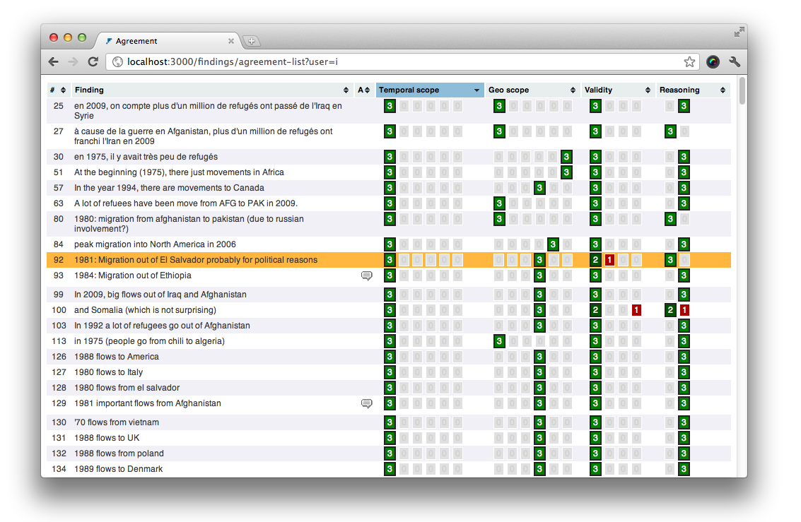

In this research study we analyzed findings made by the participants with flow maps using animation and small-multiples as two alternative ways of representing temporal
changes. 

The goal was to find out whether there are qualitative differences between the types of findings users make with these two representations. 
This required a deep analysis of the collected findings and the interaction logs. To enable this analysis
I developed web based tools for collaborative  classification of the findings, resolving disagreements in the classification and a visualization of the interaction logs.

Check [our publication](jflowmap-user-study.pdf) for more details.

