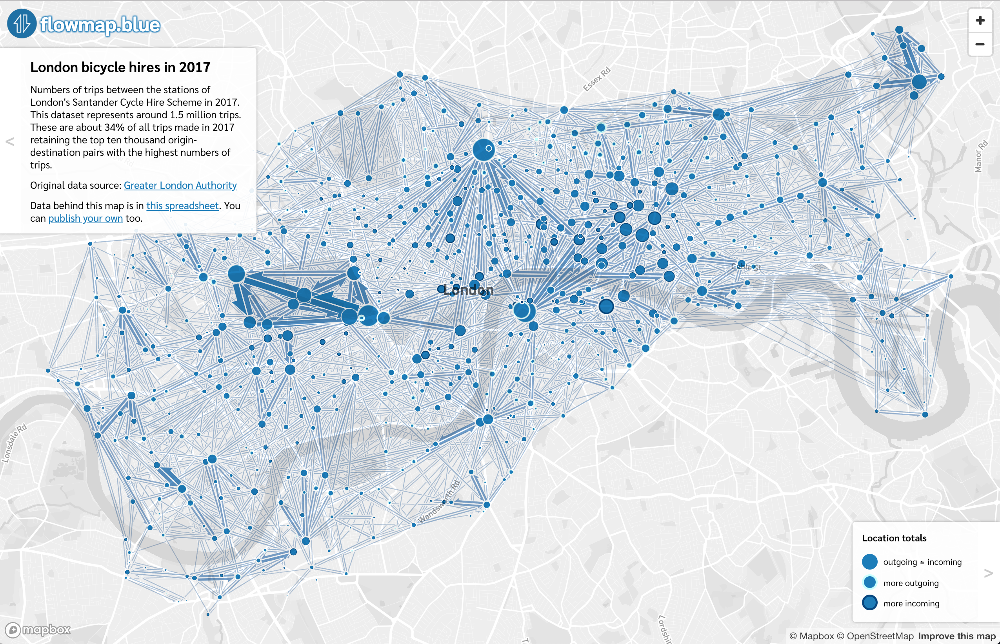

[flowmap.blue](https://flowmap.blue) is an online flow map visualization tool.
It makes it possible to publish interactive flow maps from data uploaded to Google Sheets.
Until recently making flow maps has involved manual drawing or knowledge of programming
 or specialized software. I had learned from my experience developing
 [flow](https://github.com/ilyabo/jflowmap)
 [mapping](https://github.com/ilyabo/jflowmap.js)
 [libraries](https://github.com/teralytics/flowmap.gl)
 that there was a need for a tool with which people without special knowledge could make flow maps and
 share them online. This is why I developed [flowmap.blue](https://flowmap.blue).
 It's free, it requires no installation and allows anyone to create a flow map in no time.

flowmap.blue supports automatic clustering of the locations
based on the zoom level. It's very useful for dense or messy datasets where some locations
are very close to each other and others are farther away:

