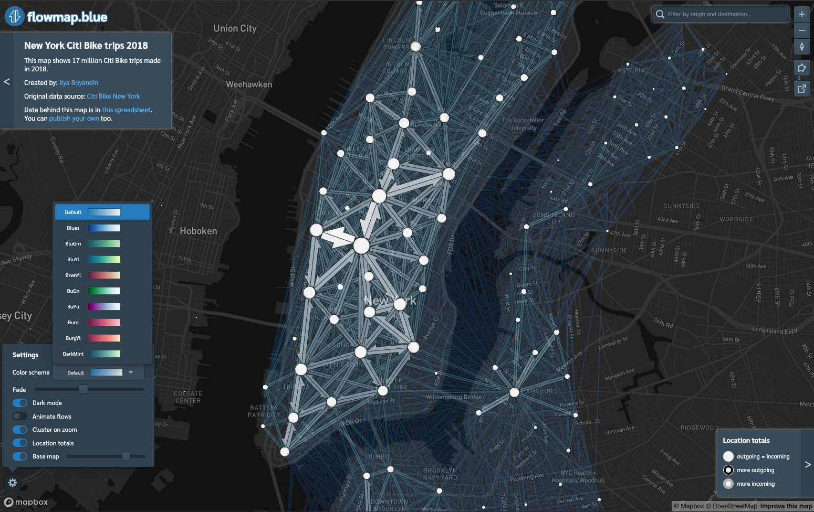
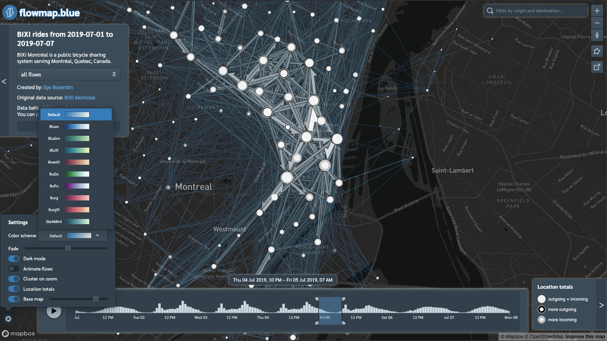
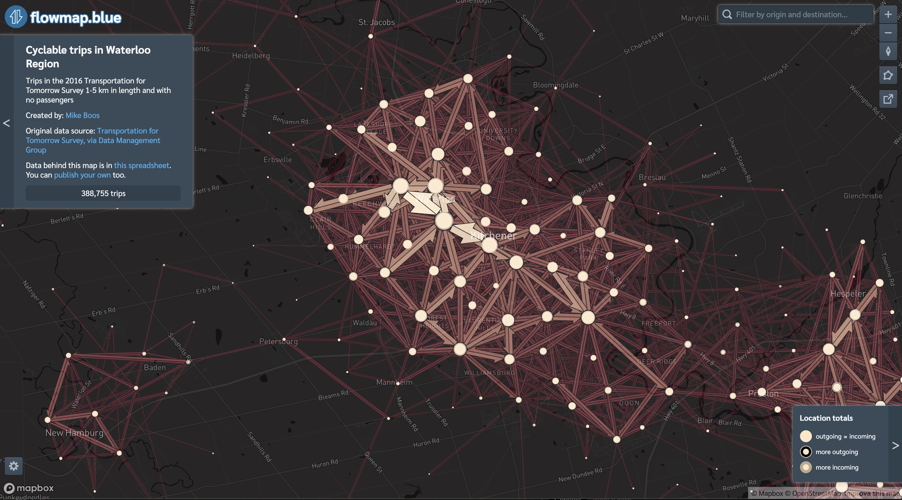

[Flowmap.blue](https://flowmap.blue) 
 is a free tool for representing aggregated numbers of movements between geographic
  locations as flow maps. It is used to visualize urban mobility, commuting behavior, 
  bus, subway and air travels, bicycle sharing, human and bird migration, refugee flows, 
  marine traffic, freight transportation, trade, supply chains, scientific collaborations,
   epidemiological and historical data and data on many other topics.

The project [won bronze](https://twitter.com/kachkaev/status/1197262339935997952) 
at the [Information is Beautiful Awards](https://www.informationisbeautifulawards.com/showcase/3815-flowmap-blue) 
in 2019. 

  
Until recently making flow maps has involved manual drawing, knowledge of programming or 
specialised software. 
 I had learned from my experience developing
 [flow](https://github.com/ilyabo/jflowmap)
 [mapping](https://github.com/ilyabo/jflowmap.js)
 [libraries](https://github.com/teralytics/flowmap.gl)
 that there was a need for an *easy-to-use* tool with which people without special 
knowledge could make flow maps. 
This is why I decided to develop flowmap.blue. 
The tool makes it possible to publish interactive flow maps from data uploaded to Google Sheets.
 It's free, it requires no installation and allows anyone to create a flow map in no time.

<iframe src="https://player.vimeo.com/video/378757494" width="640" height="360" frameborder="0" allow="autoplay; fullscreen" allowfullscreen></iframe>
