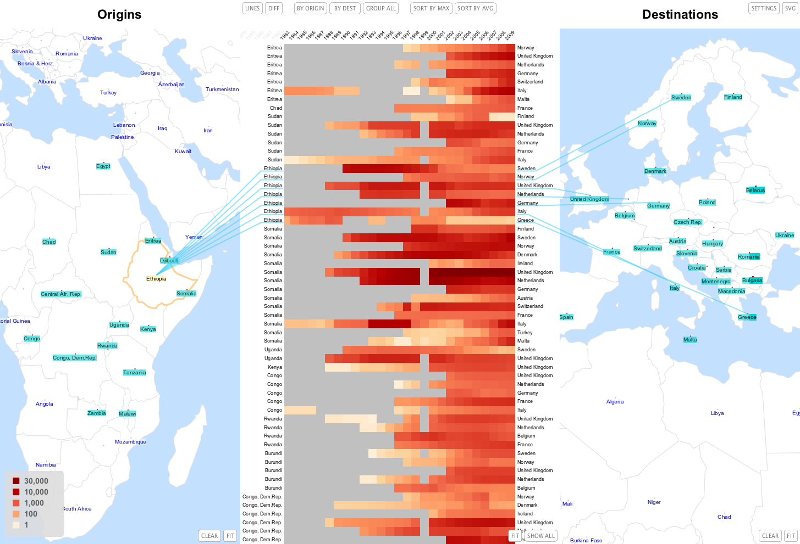
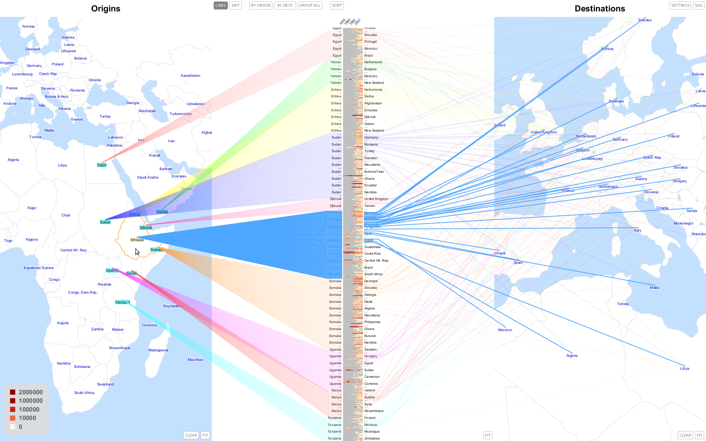
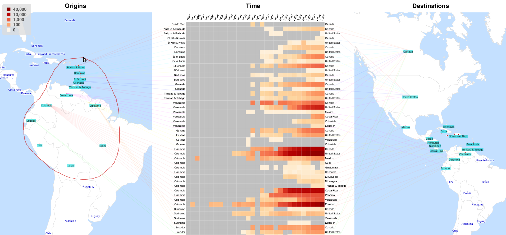
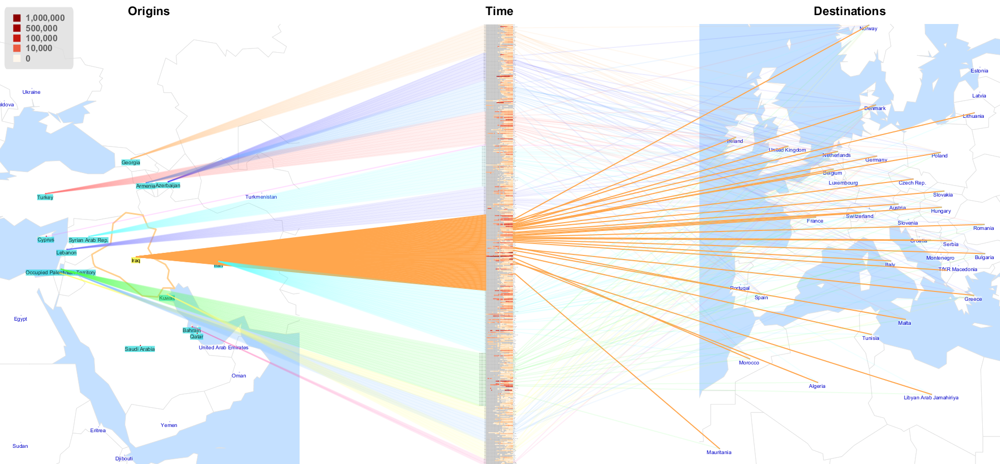
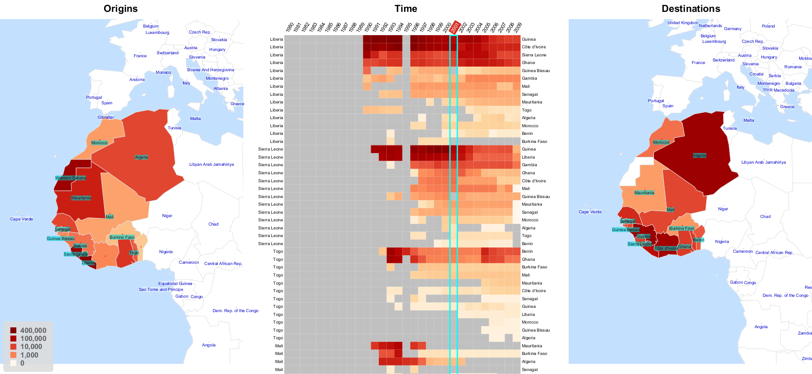
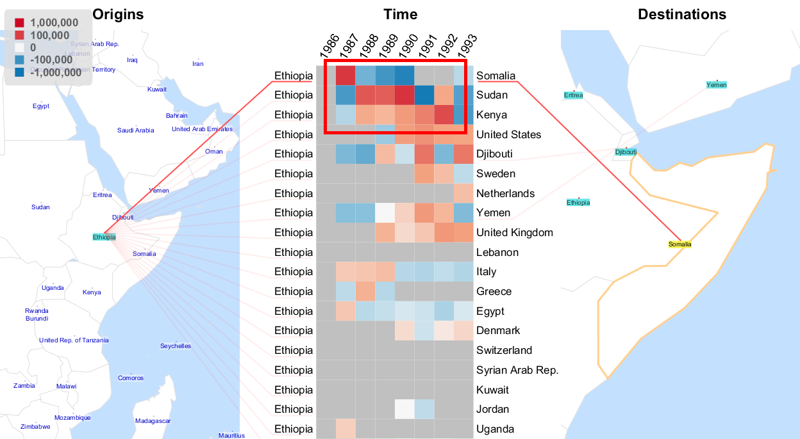

Flowstrates extend the idea of a [flow map](http://en.wikipedia.org/wiki/Flow_map) (which are used for representing entities flowing between geographic locations) to the temporal dimension and allow to analyze the changes of the flow magnitudes over time. In Flowstrates the origins and the destinations of the flows are displayed in two separate maps, and the temporal changes of the flow magnitudes are displayed between the two maps in a heatmap in which the columns represent time periods.

<iframe width="560" height="315" src="https://www.youtube.com/embed/nij8OUyiaV0?rel=0&amp;controls=0&amp;showinfo=0" frameborder="0" allow="autoplay; encrypted-media" allowfullscreen></iframe>

As in most flow maps which focus on representing the flow magnitudes, the exact routes of the flows are not accurately represented in Flowstrates. Instead, the flow lines are rerouted so that they connect the flow origins and destinations with the corresponding rows of the heatmap, as if the flows were going through it. The flow lines help to see in the geographic maps the origins and the destinations corresponding to each of the flows shown in the heatmap.

<iframe width="560" height="315" src="https://www.youtube.com/embed/UQPN7o6A3Cg?rel=0&amp;showinfo=0" frameborder="0" allow="autoplay; encrypted-media" allowfullscreen></iframe>

Flowstrates are meant for interactive exploration. Unlike OD-matrices which represent exactly one flow in each matrix cell, in Flowstrates every flow occupies one whole row of the heatmap for showing how the flow changed over time. Hence, much more screen real estate is used to represent the same number of flows, and for many datasets it is impossible to display all the flows simultaneously on the screen without filtering or aggregating them. Therefore, to allow the users to explore the whole data in every bit of detail Flowstrates provide interactive support for performing spatial visual queries, focusing on different regions of interest for the origins and destinations, zooming and panning, sorting and aggregating the heatmap rows.

You can also read our [paper on Flowstrates](flowstrates-eurovis11-fin.pdf) published in Computer Graphics Forum.

Flowstrates is a part of JFlowMap, an open-source tool for the analysis of spatial interactions.
JFlowMap can be downloaded from [here](https://code.google.com/p/jflowmap/downloads/list).
The source code is available at [github.com/ilyabo/jflowmap](https://github.com/ilyabo/jflowmap/).
 
Here is a promotional video about the project: 
<iframe width="560" height="315" src="https://www.youtube.com/embed/ntY2i7toBPo?rel=0&amp;showinfo=0" frameborder="0" allow="autoplay; encrypted-media" allowfullscreen></iframe>

 

 

 

 

