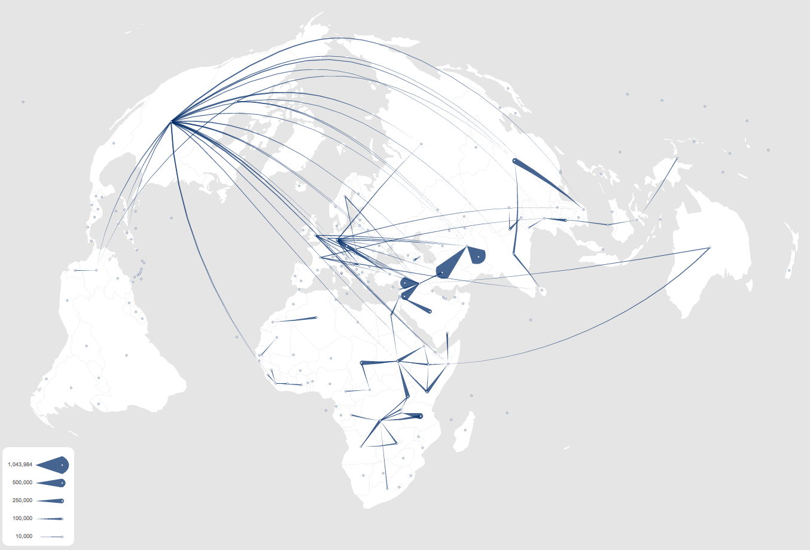

Flow map visualization showing refugees data by UNHCR using tapered arrows and 
the "flying meteor" metaphor to show the directions of the flows. 

[Try in action](https://ilya.boyandin.me/jflowmap.js/).

The source code is available at [github.com/ilyabo/jflowmap.js](https://github.com/ilyabo/jflowmap.js).
