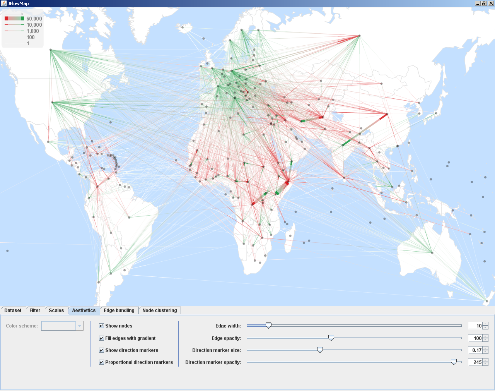
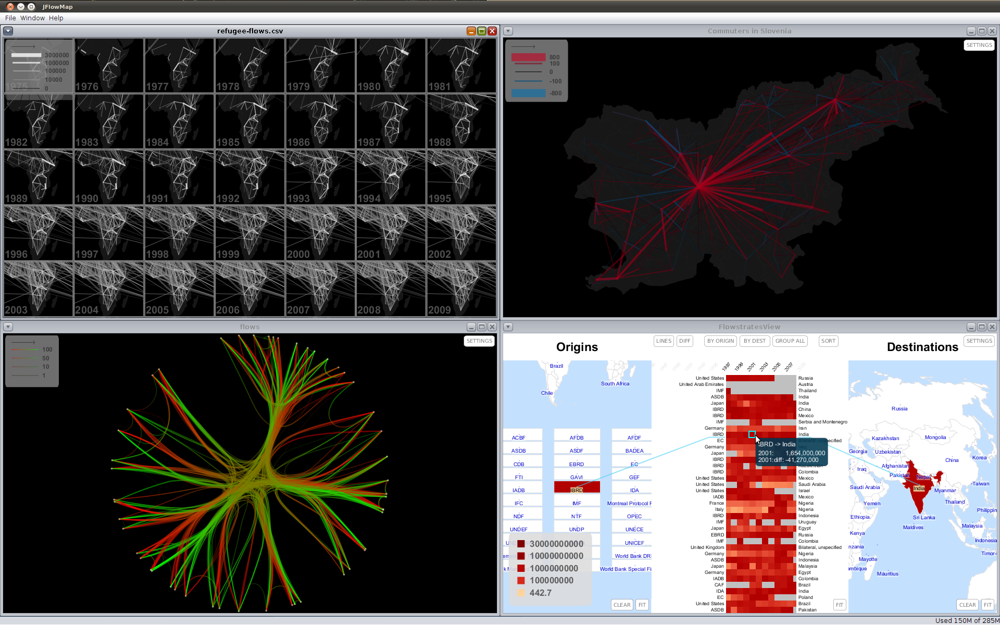
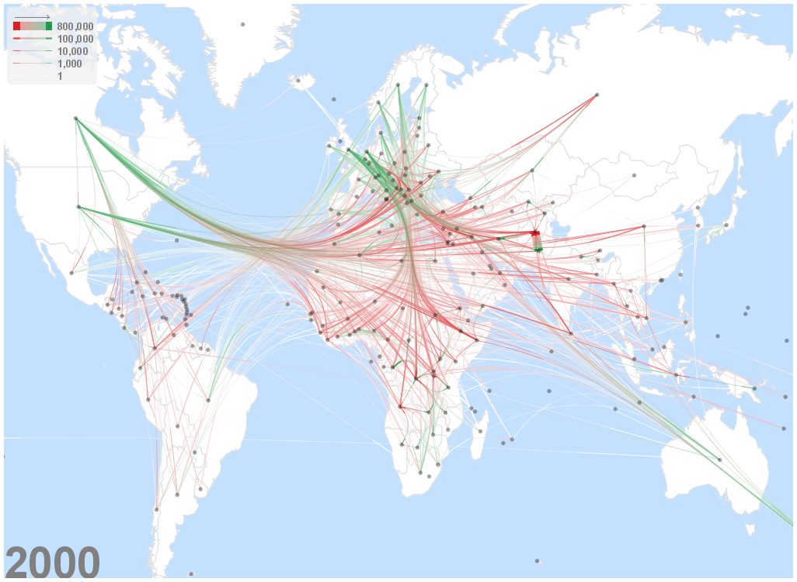
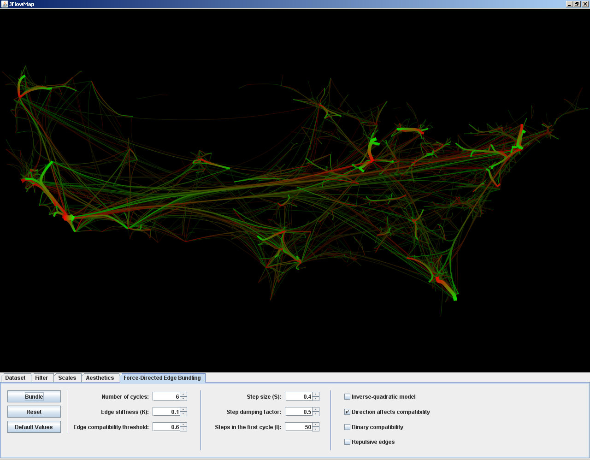
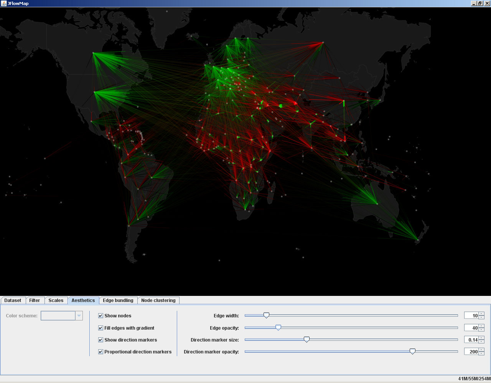
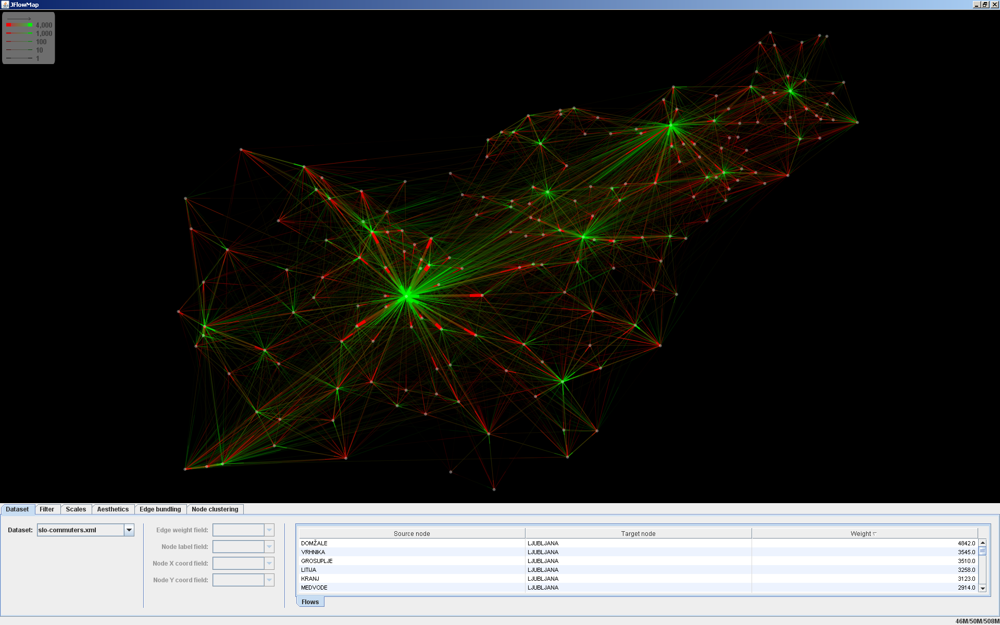

A visualization tool in which we experiment with various visualization techniques for spatial interactions, i.e. interactions between pairs of geographic locations. These can be migrations, movement of goods and people, network traffic, or any kind of entities "flowing" between locations. Spatial interactions are often represented as origin-destination data, meaning that only the origins, the destinations and the magnitudes of the flows are known, but not the exact flow routes.

JFlowMap can be downloaded from [here](https://code.google.com/p/jflowmap/downloads/list).
The source code is available at [github.com/ilyabo/jflowmap](https://github.com/ilyabo/jflowmap/).

         
