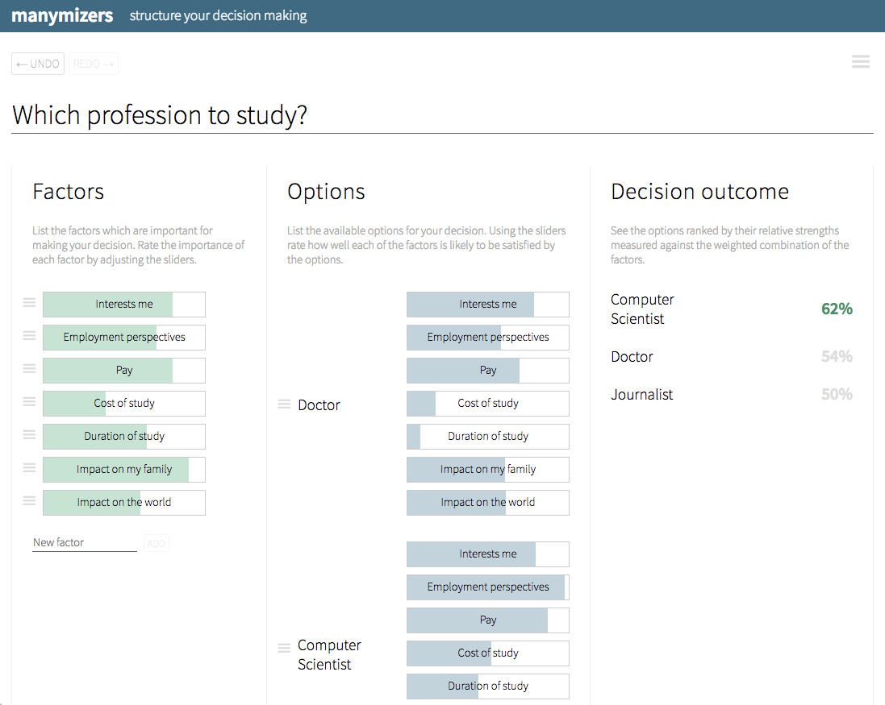

This is an experimental tool for helping to structure decision making written in Clojure.
It was a way for me to learn this beautiful language. 
The tool was largely inspired by the original version of 
[ChoiceMap](https://techcrunch.com/2014/01/09/meet-choicemap-a-new-app-that-helps-you-make-better-decisions/).

<a href="https://manymizers.netlify.com/" target="_blank" rel="noopener">Try in action</a>.

The source code is available at [github.com/ilyabo/manymizers](https://github.com/ilyabo/manymizers).

.

         

