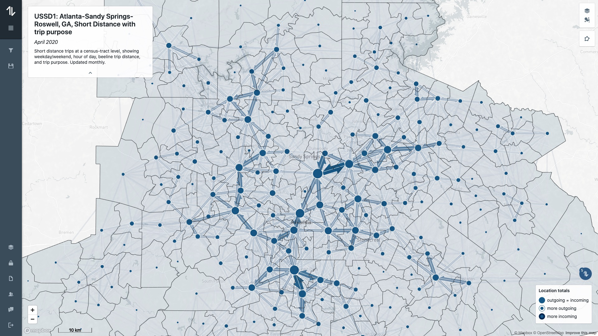
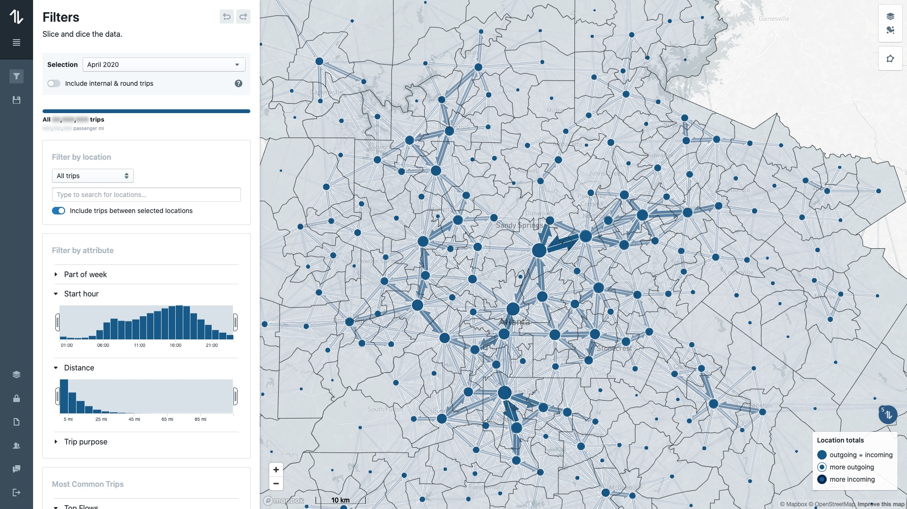
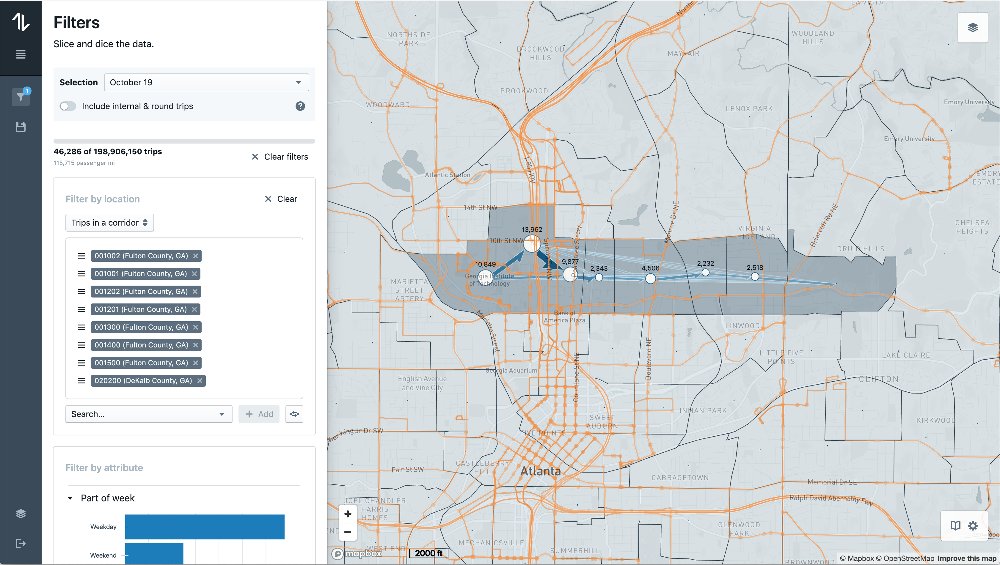
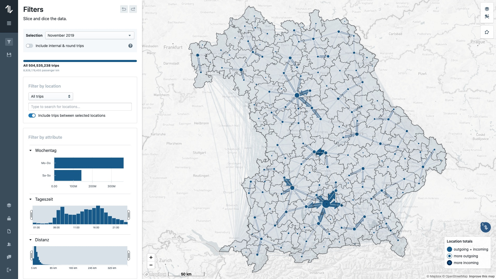
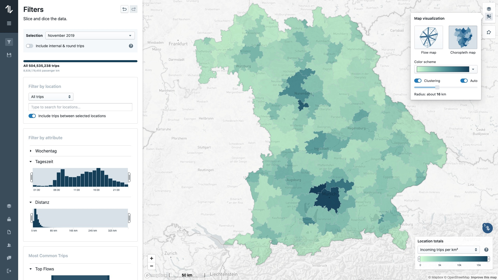
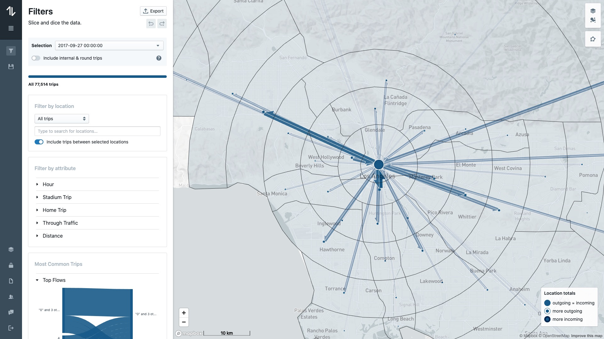
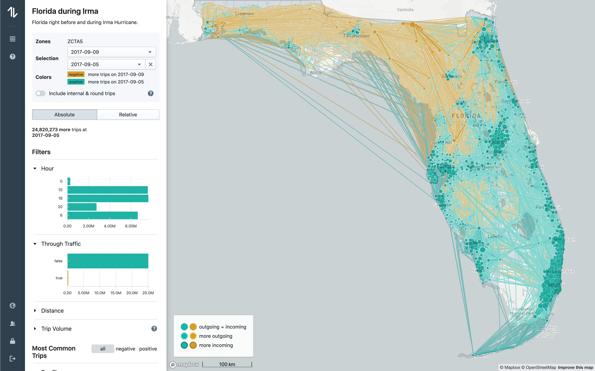

OD-matrix app is an interactive web application we developed at [Teralytics](http://teralytics.net)
for representing and analyzing mobility data in cities and countries (origin-destination data). 
The scalability - supporting large OD-datasets with billions of rows - was a challenge. 
Read [the blog post](https://medium.com/teralytics/visualizing-mobility-data-the-scalability-challenge-2575fe819702) to learn more about 
 how we addressed it.

