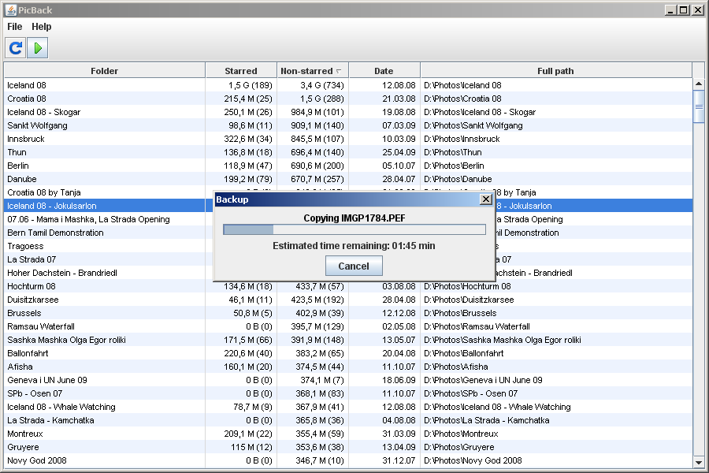
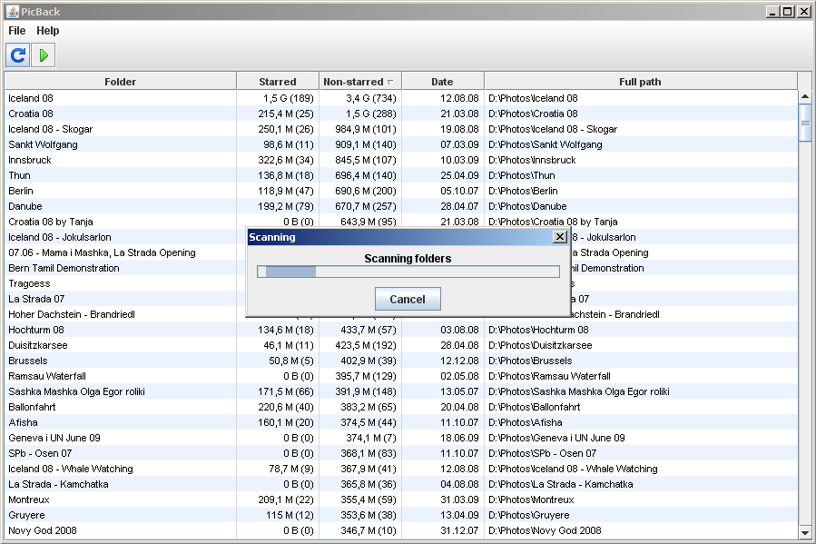
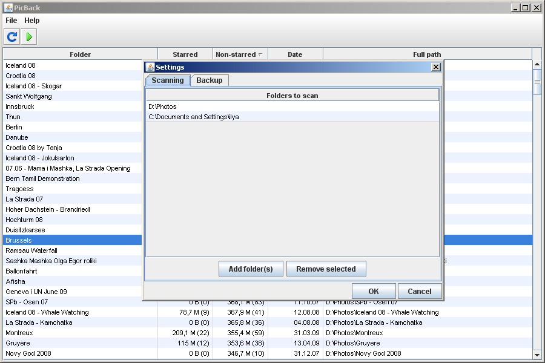

PicBack is an app for making backups of large collections of photos. The app was developed in Java.

More details and the source code: [https://code.google.com/archive/p/picback/](https://code.google.com/archive/p/picback/)

