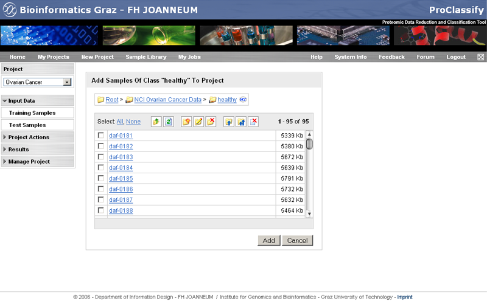
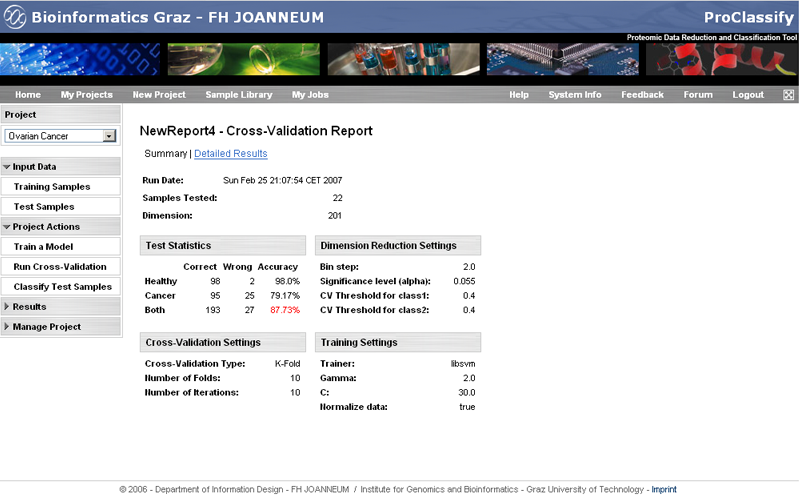
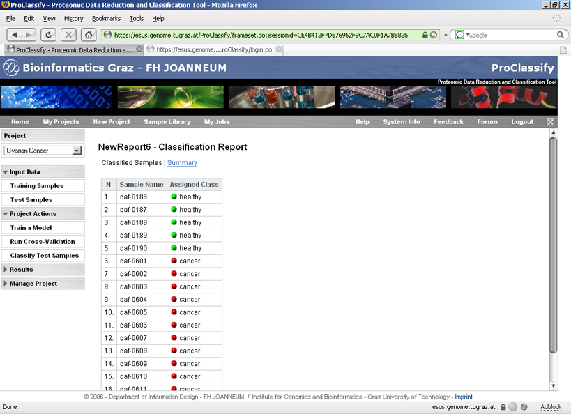
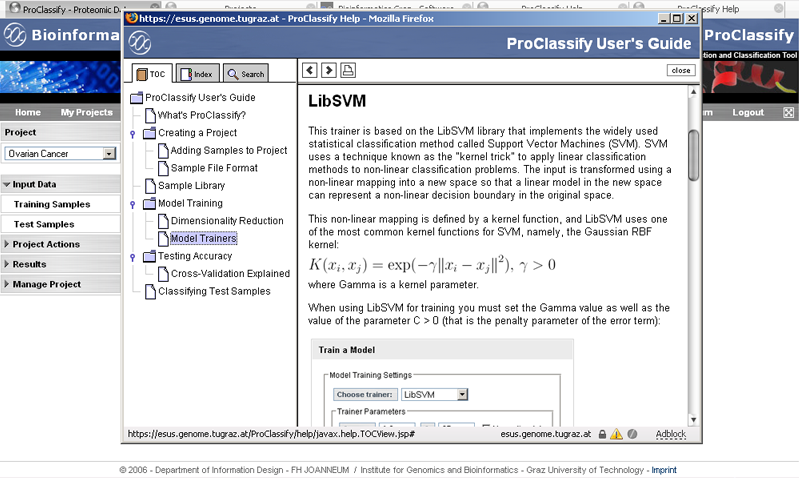
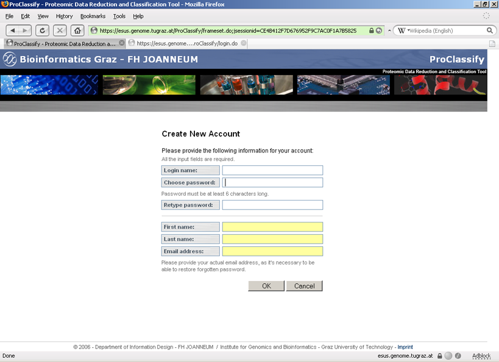
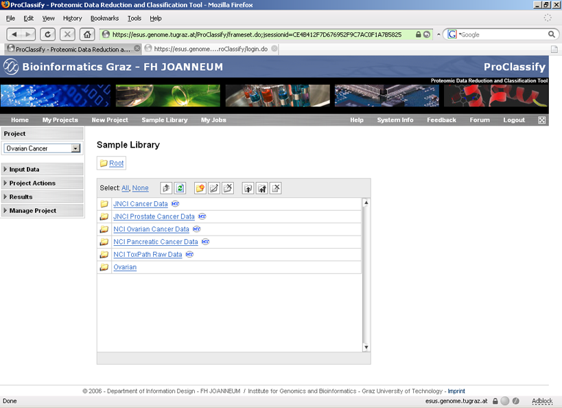
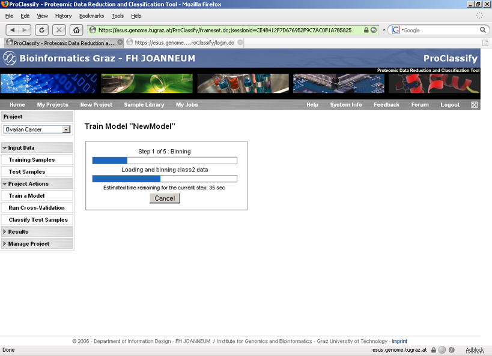

A Web version of [ProClassify](/proclassify) developed to facilitate sharing of datasets and computational capacities by the users. The features of the web version are mostly identical to the standalone version except the data visualization which is missing in the web version. 

 

 

  

 

 

 

 

 

 

 

