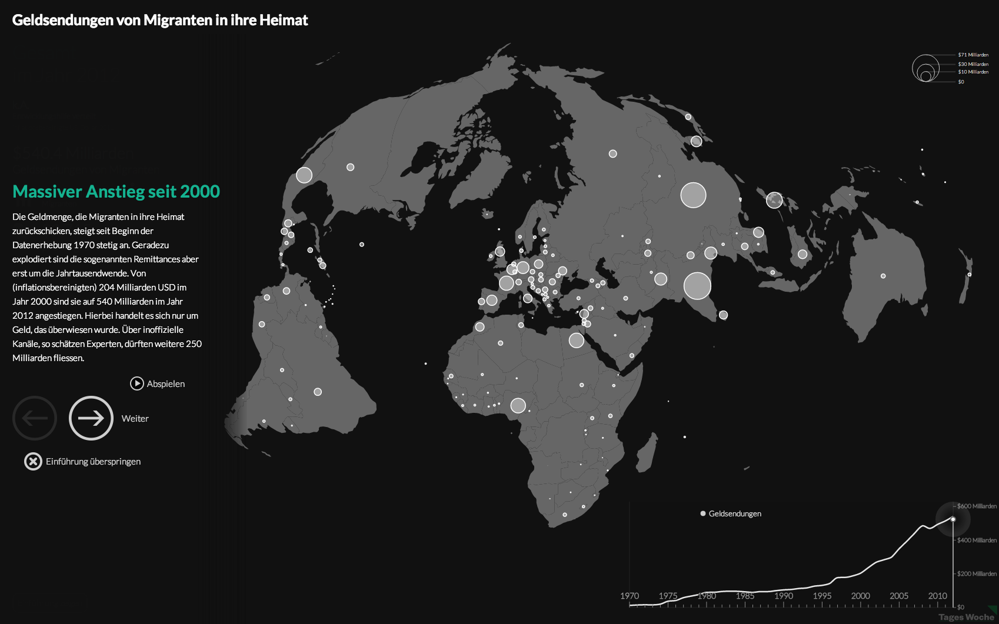
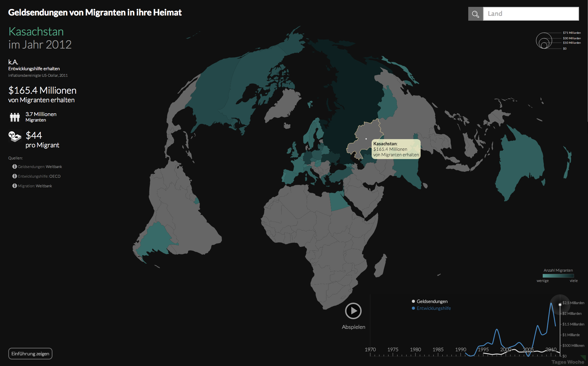

Visualizing flows of money sent by migrants to their home countries. 
Together with <a href="http://www.davidbauer.ch/">David Bauer</a> and 
<a href="http://renestalder.me/">René Stalder</a>.

 [Try in action](https://ilyabo.github.io/remittances/?en) or [fork on github](https://github.com/ilyabo/remittances).
 
 
 
 

The visualization was published by the newspapers 
<a href="http://www.tageswoche.ch/de/2013_19/schweiz/540004/milliarden-aus-der-fremde.htm">TagesWoche.ch</a> 
and <a href="http://derstandard.at/1363710784566/Wieviel-Geld-Migranten-zurueck-in-ihre-Heimat-schicken">derStandard.at</a>. 
It was also <a href="http://visualizing.org/visualizations/incredible-rise-migrants-remittances">featured on Visualizing.org</a> 
as one of the highlights of May 2013.
