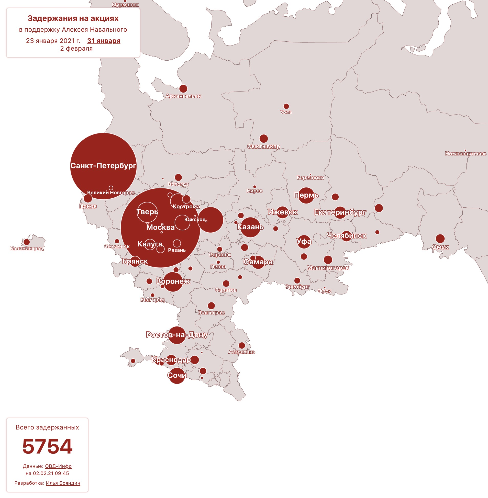
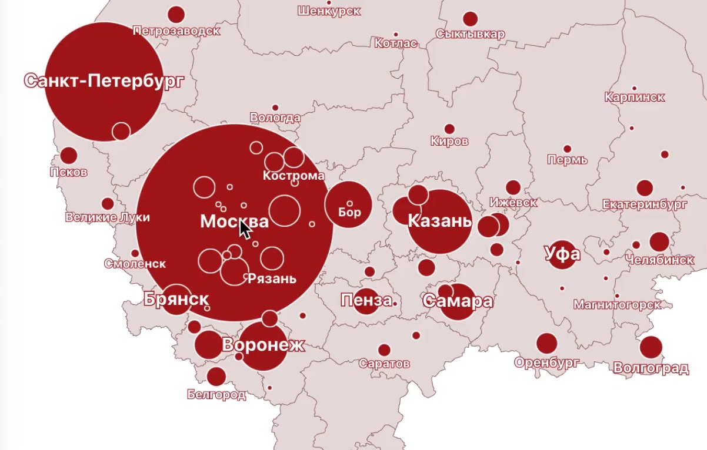

The map represents the numbers of detainments
during the peaceful protests in early 2021 across cities in Russia.

Check out the [live version](https://navalny-230121-map.netlify.app/?2021-01-23)

<video width="100%" controls style="max-width: 900px" autoplay loop>
    <source src="flatbush-labels.mp4" type="video/mp4"/>
  
</video>

