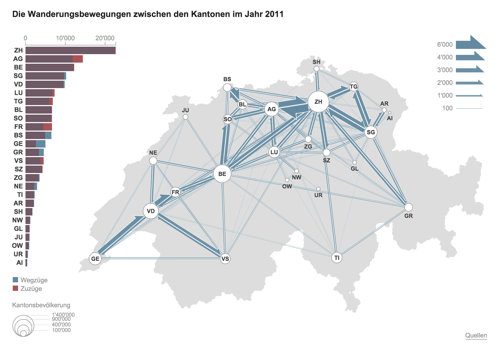
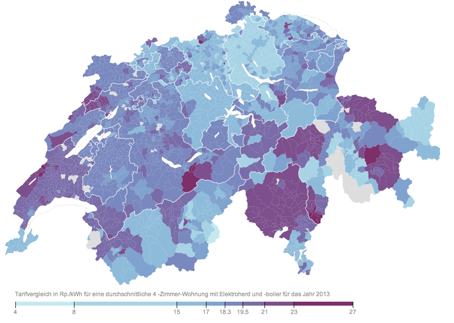
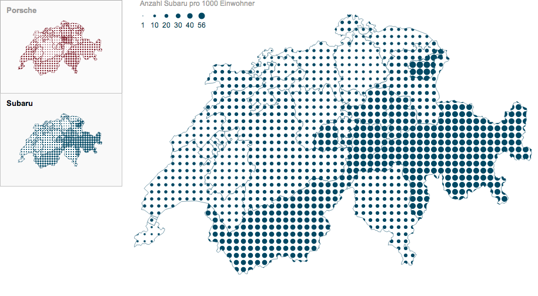
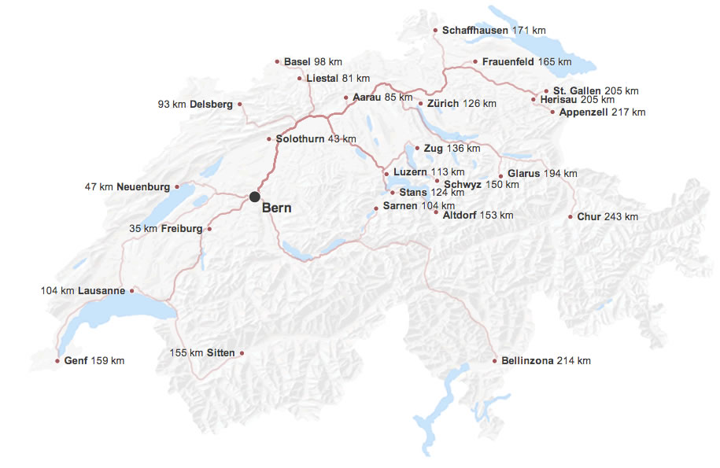
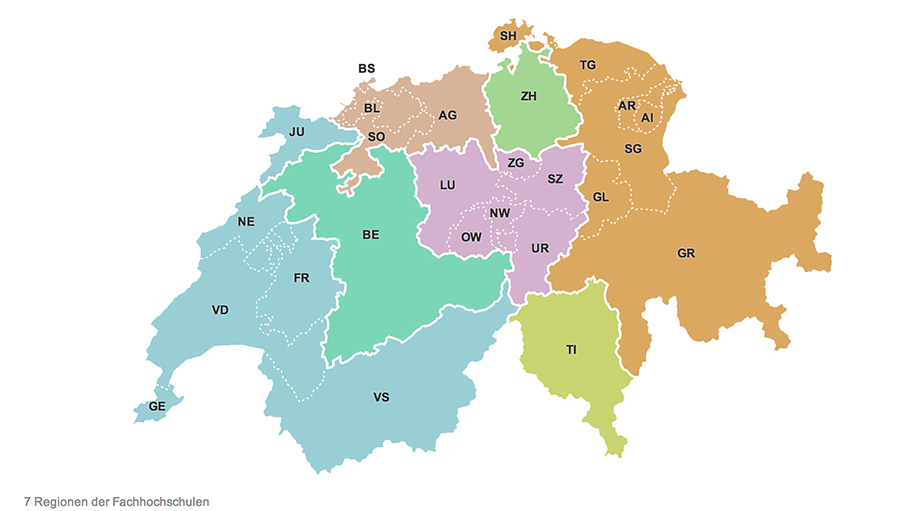
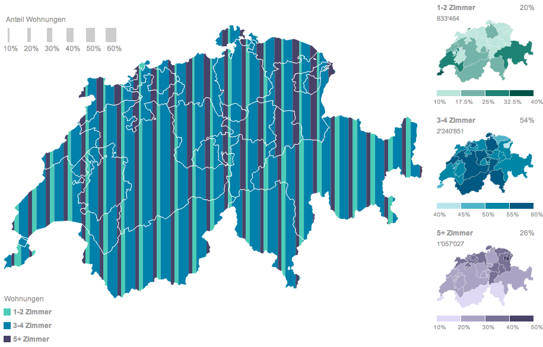
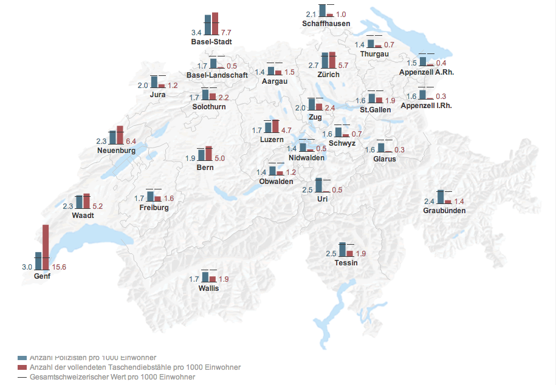
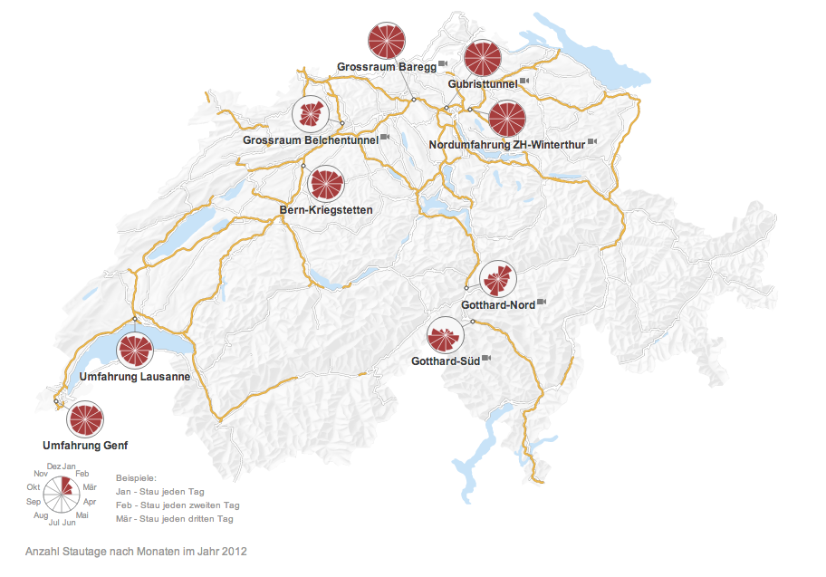
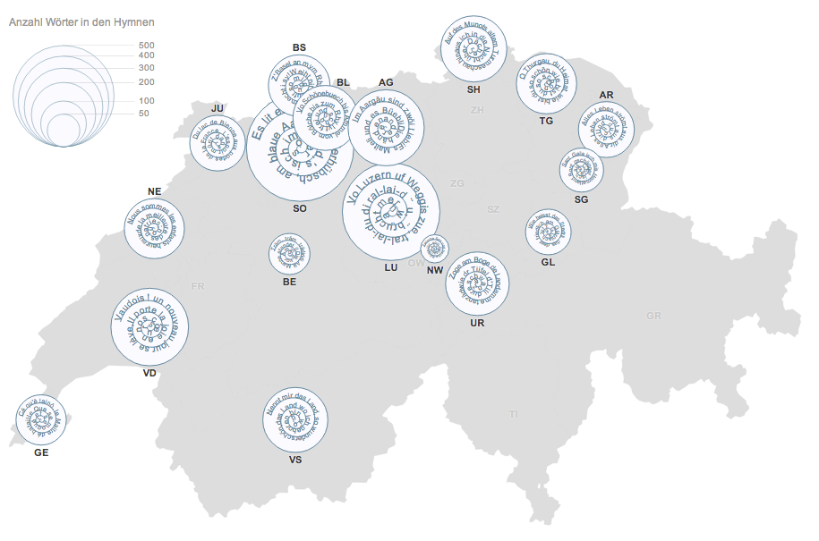

As a member of the team at <a href="http://interactivethings.com">Interactive Things</a> 
I worked on a series of twenty visualizations called "Swiss maps" for <a href="http://www.nzz.ch/aktuell/inland-sommerserie-schweizer-karten-interaktiv/">Neue Zürcher Zeitung</a>. 

The series won the first prize in the category of interactive graphics in the German Press Agency <a href="http://www.dpa.de/Pressemitteilungen-Detailansic.107+M5d04e3a21eb.0.html">dpa-infografik award 2013</a>.

Click on the images below to see the interactive versions: 

