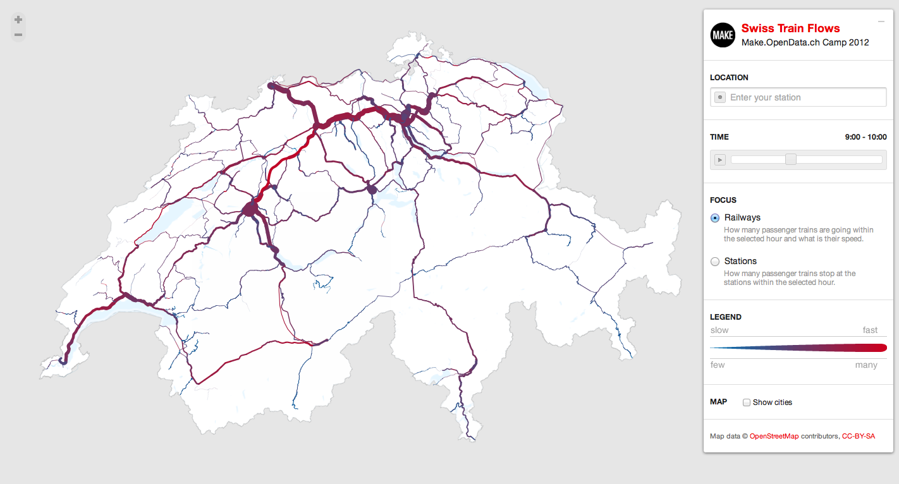
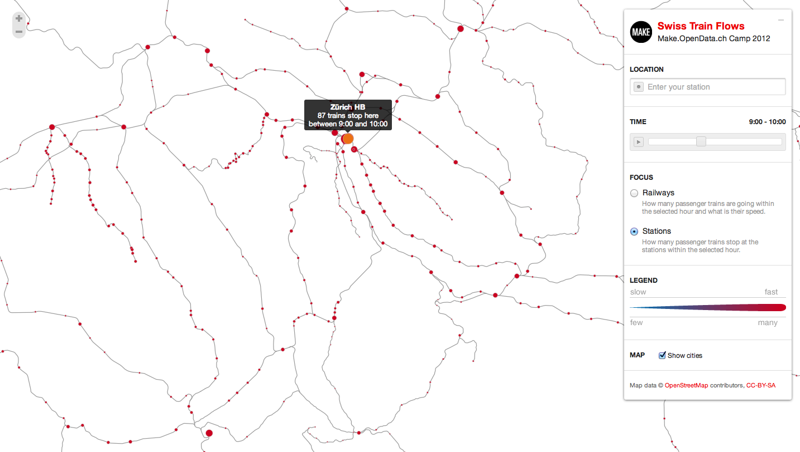
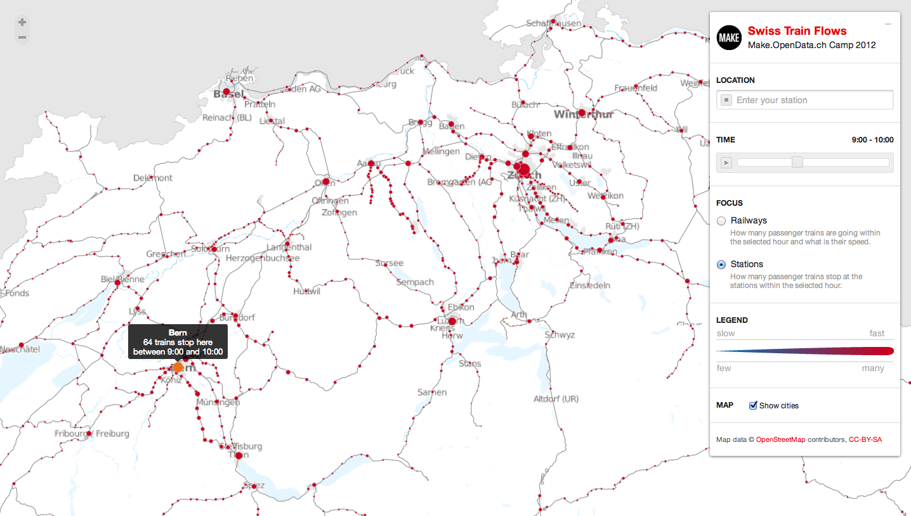
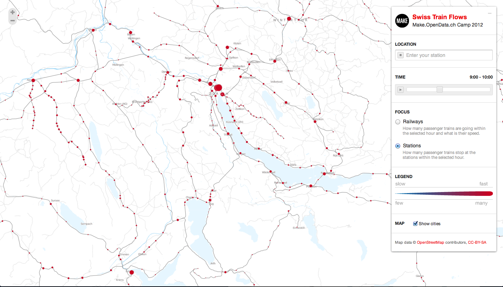

Animated interactive visualization of train flows in Switzerland showing the numbers and the speeds of the trains during different time of the day.
Developed in a team of fellow hackers during the [make.opendata camp](http://make.opendata.ch/)  in Zurich.

Try in action [here](http://flows.transport.opendata.ch/).

