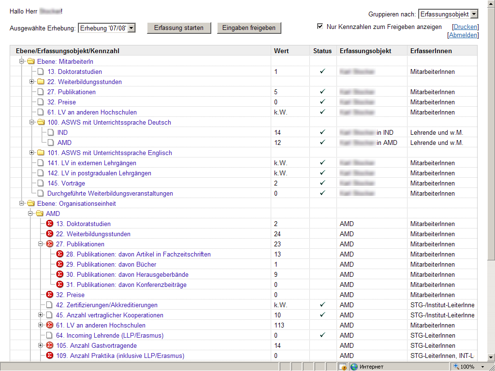
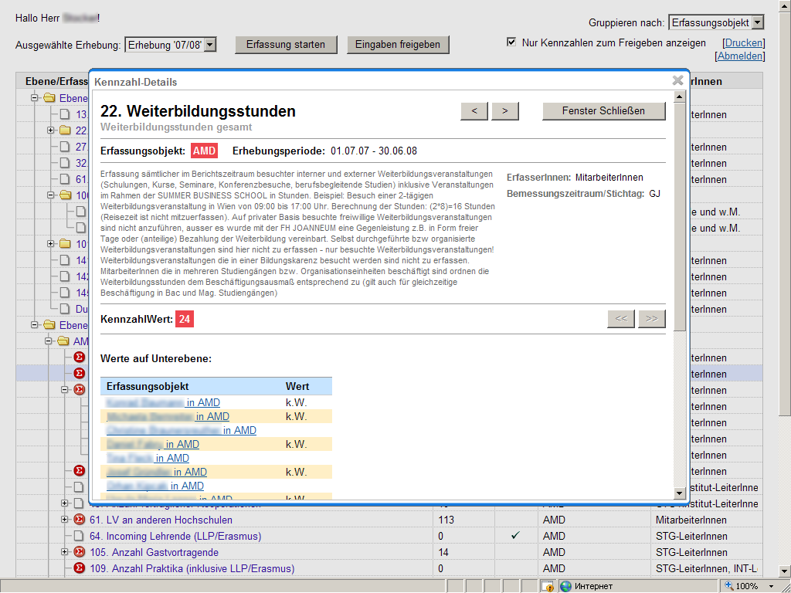
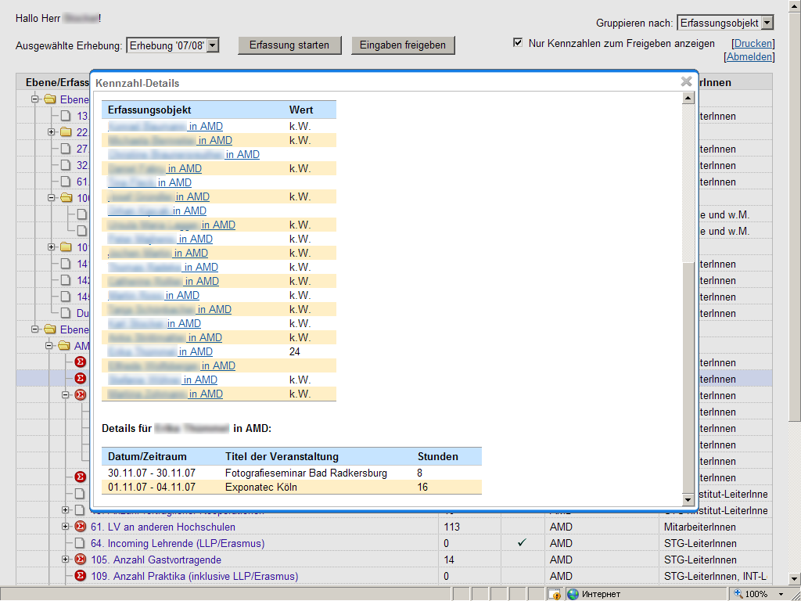
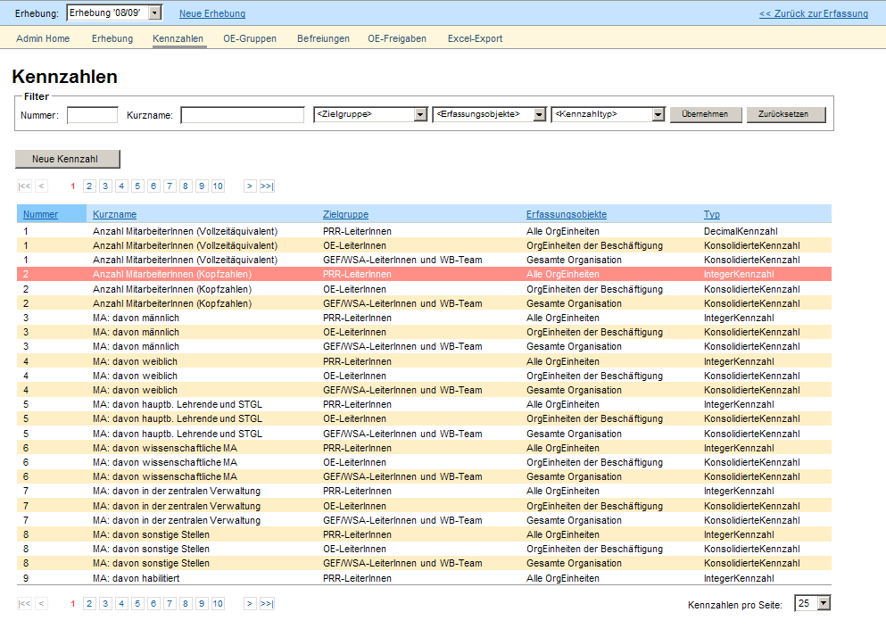
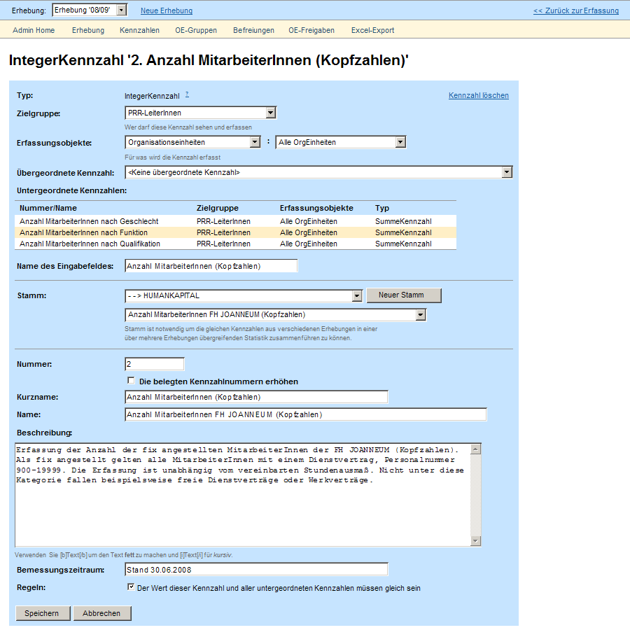
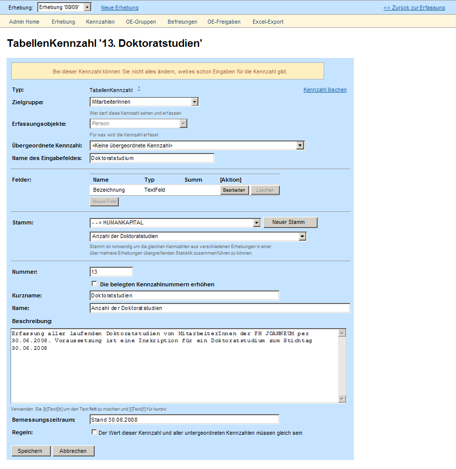
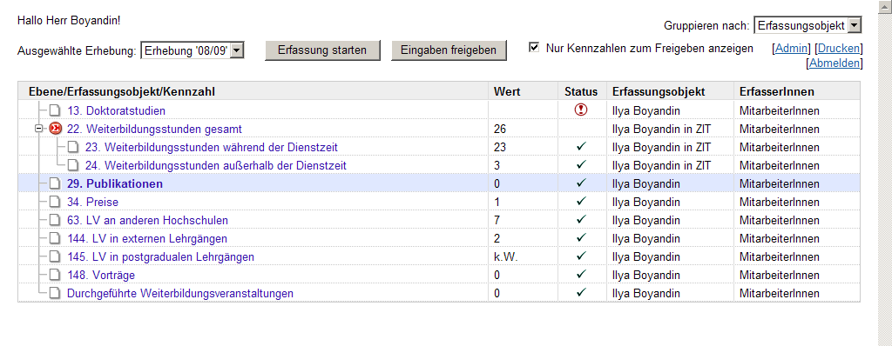
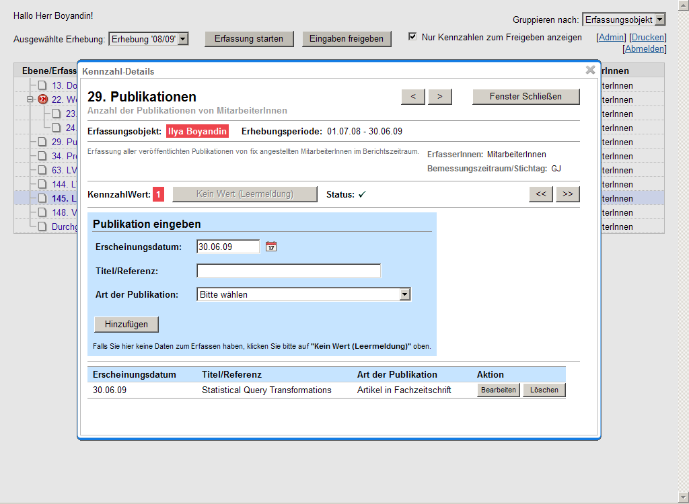

A web application for collaborative data collection and consolidation to provide a statistical overview of study- and research-relevant indicators.

The app was developed for the 
Graz University of Applied Sciences [FH JOANNEUM](http://www.fh-joanneum.at).
 

