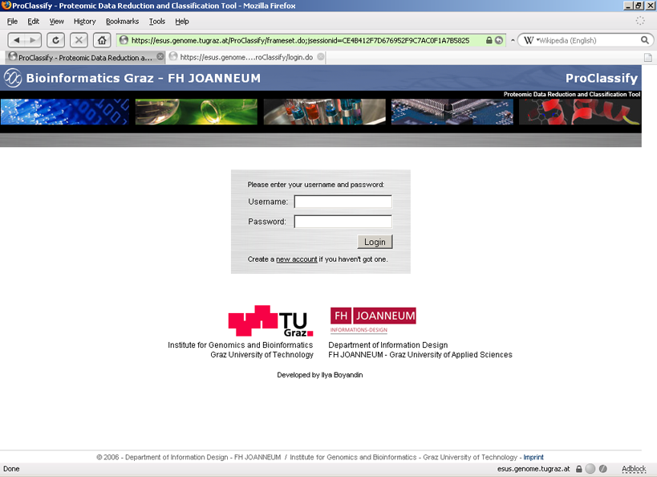

An implementation of the feature selection and classification method which was developed at the Institute for Genomics and Bioinformatics (TU Graz). The method was meant originally for cancer detection on proteomics mass-spectroscopy data, but appears to be useful for completely different datasets too. 

ProClassify is free for non-commercial use and can be downloaded from [this website](http://genome.tugraz.at/proclassify/proclassify_description.shtml). 

 

 

 

 

 

 

 

 

 

 

 

A Web version of ProClassify developed to facilitate sharing of datasets and computational capacities by the users. The features of the web version are mostly identical to the standalone version except the data visualization which is missing in the web version. 

The online version is available [here](https://esus.genome.tugraz.at/ProClassify). And here is the [User's Guide](https://esus.genome.tugraz.at/ProClassify/help/showHelp.jsp). 

 

 

  

 

 

 

 

 

 

 

