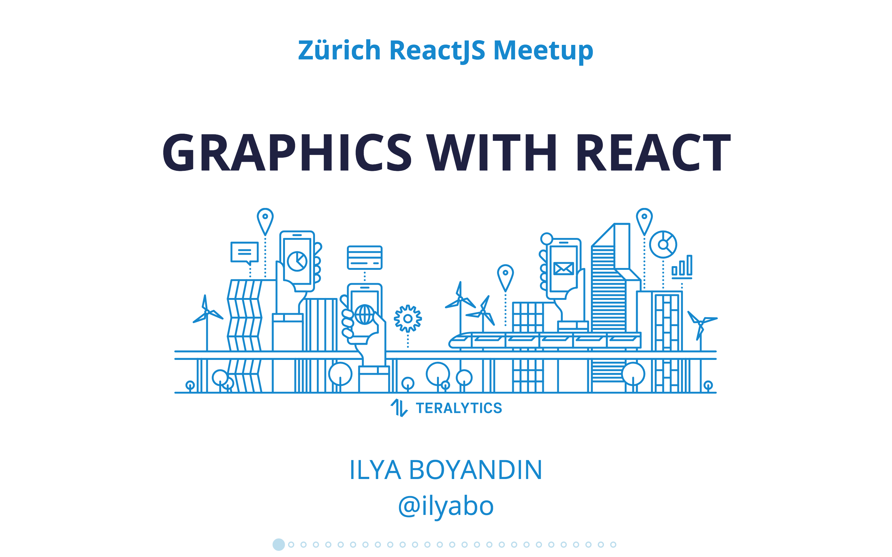
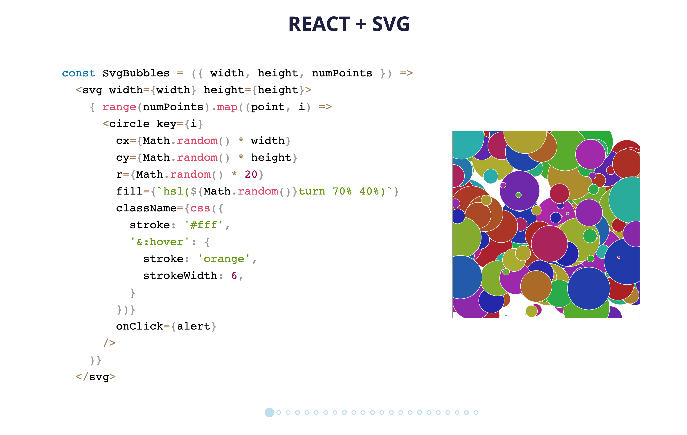

[Slides from the talk "Graphics with React"](https://ilya.boyandin.me/graphics-with-react/#/)
 in which I discussed the tradeoffs and some good practices about the use of SVG, Canvas and WebGL 
 (presented at [Zurich ReactJS Meetup](https://www.meetup.com/Zurich-ReactJS-Meetup/events/251517816/)).  

The source code for the slides (which are a React app) is available at 
[github.com/ilyabo/graphics-with-react](https://github.com/ilyabo/graphics-with-react).
