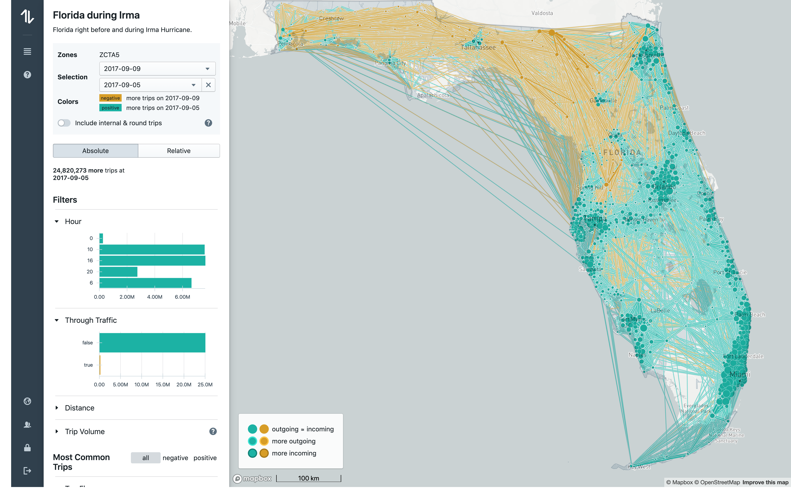

I was invited to give a talk
at the <a href="https://gflowizworkshop.sciencesconf.org" target="_blank" rel="noopener">GFlowiz workshop</a>
at <a href="http://www.ifsttar.fr/en/welcome/" target="_blank" rel="noopener">IFSTTAR</a>
about the  tools we build for exploring large OD-datasets with hundreds of millions of records.
In the talk I demonstrated the dashboard we are developing at 
<a href="https://www.teralytics.net" target="_blank" rel="noopener">Teralytics</a>
for the analysis of this kind of data.
(<a href="https://goo.gl/D36oSi" target="_blank" rel="noopener">Slides</a> and <a href="https://www.youtube.com/embed/WZpFXLhleEQ?rel=0" target="_blank" rel="noopener"> video recording</a>).

<iframe src="https://docs.google.com/presentation/d/e/2PACX-1vTqB406jn_4-B0T4ZepPdcyw3_98ST-zeEId9jm_6atMn8FdZGq-QviH_acODs_aSGTbCcJtadTtrvZ/embed?start=false&loop=false&delayms=3000" frameborder="0" width="960" height="569" allowfullscreen="true" mozallowfullscreen="true" webkitallowfullscreen="true"></iframe>

Here's the abstract of the talk:

> Origin-destination (OD) data represent numbers of movements of people or goods between locations. The size of such data depends quadratically on the number of locations involved. It can quickly grow to hundreds of millions of rows when flow attributes like time, mode of transport, duration are added to the dataset. Such large datasets cannot be entirely visualized in one image. Their analysis requires the use of summarization or interactive exploration techniques.
>
> I will speak about the web applications we are building at Teralytics for the analysis of movement of people in cities and countries. Scalability to the always growing data is an important challenge we are facing. I will discuss how we are using geographic flow map visualizations and other representations in this context, how we support querying across space and time and how we apply techniques like cross-filtering and on-the-fly aggregation for slicing and dicing the data. I will elaborate on choosing the right tools and the system architecture to ensure smooth interactivity and short query response times necessary for such interactive analysis.

Here are <a href="https://goo.gl/D36oSi" target="_blank" rel="noopener">the slides</a>
and a video recording:

<iframe width="560" height="315" src="https://www.youtube.com/embed/WZpFXLhleEQ?rel=0" frameborder="0" allow="accelerometer; autoplay; encrypted-media; gyroscope; picture-in-picture" allowfullscreen></iframe>

