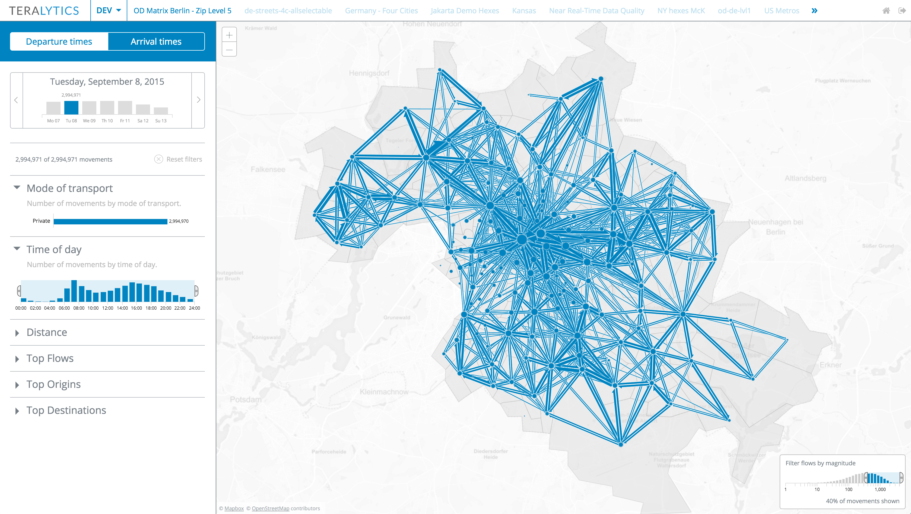

Working at <a href="http://www.teralytics.net" target="_blank">Teralytics</a> 
I developed exploratory tools for the analysis of geographic movement of people.

The following dashboard makes it possible to explore the movement of people 
 on the scales of a city or even a country:

*Movement of people in Berlin*

  

*Transport dashboard US*