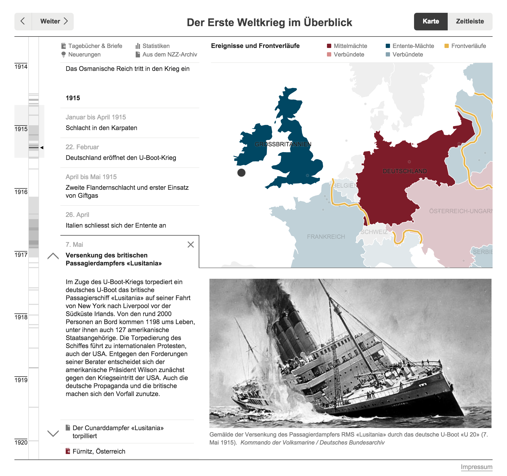

An interactive storytelling piece engaging the audience to explore the events of the World War I. 
Produced in collaboration between
<a href="http://interactivethings.com" target="_blank">Interactive Things</a> and <a href="http://www.nzz.ch" target="_blank">Neue Zürcher Zeitung</a>.

 

 

 

Check out the <a target="_blank" href="http://maps.nzzdali.ch.global.prod.fastly.net/nzzdata/erster-weltkrieg/">online version</a>.
